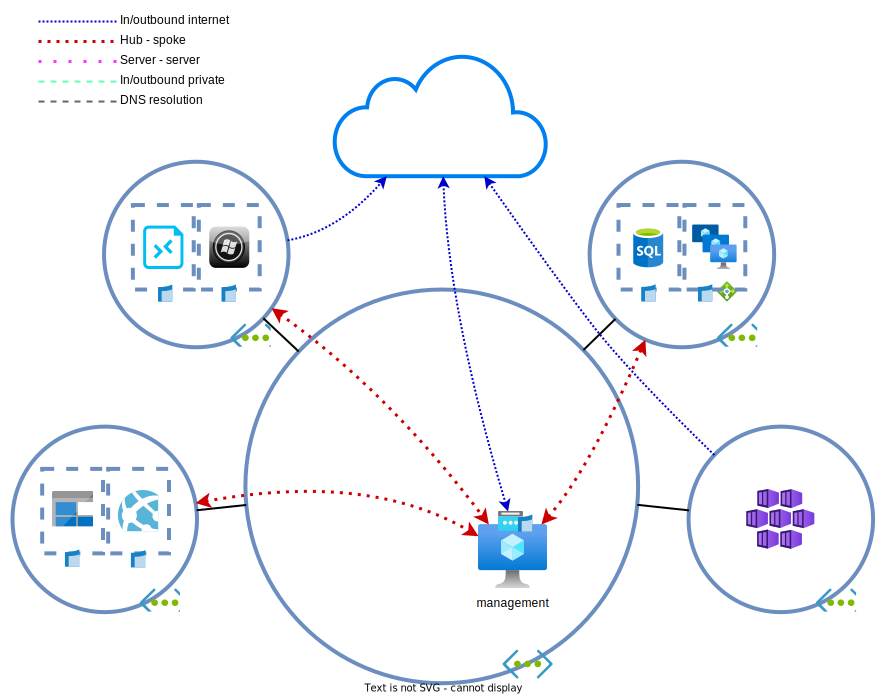

# Day 1 - Networking basics

* [Uitrollen hub/management netwerk](#uitrollen-hub/management-netwerk)
* [Uitrollen spoke/applicatie netwerken](#uitrollen-spoke/applicatie-netwerken)
* [Uitrollen applicatie server](#uitrollen-applicatie-server)
* [NSG/ASG](#nsg/asg)
* [Logging en archivering](#logging-en-archivering)
* [Opruimen lab](#opruimen-lab)

BY wants to run some REST APIs (and other services) in the cloud. These applications must be geographically redundant. The insurer does want a central management (hub) `virtual network` from which all management can be performed

All resources must (when possible) be hardened by way of `network security groups`. During initial development, only the management server may be reachable from the internet.

After some [research](https://learn.microsoft.com/en-us/azure/cloud-adoption-framework/ready/azure-best-practices/hub-spoke-network-topology), you and the team have decided to use the [hub and spoke](https://learn.microsoft.com/en-us/azure/architecture/reference-architectures/hybrid-networking/hub-spoke?tabs=portal) model.

It allows for a central management/hub network connected that can communicate with all peered spoke networks. The spokes however cannot communicate with each other and as such, is secure by default.



It's an architecture that fits most use cases, even for cloud-native workloads.

## Deploying the management/hub network

> **NOTE:** Deploy each `virtual network` in a separate `resource group`. This helps with your overview of the resources.

The first network to be deployed will be the management network. This network will allow administrators and developers to access and manage their IT stack. For now, the server is allowed to be internet accessible, but only for BY employees.

There is no client VPN solution available yet and it isn't a business priority during the first few weeks. Most of the funds should go to developing their core business. As everything is in development and not production yet, the VMs need to automatically shut down during non-working hours.

> **NOTE:** Use `Standard_SSD` or `Standard_HDD` disks. **DO NOT** use `premium` disks.

> **NOTE:** Use the `Standard_B2ms` size for the management server.

1. Create a hub `virtual network` with a /16 `address space`.

1. Create an `NSG` for the management subnet. It's better to configure your security before creating the workload.
    * Allow inbound RDP from your public IP. We'll use this for management of the environment.
    * Deny all other inbound traffic from the internet
    * **DO NOT** block internal inbound traffic.
    > <details><summary>Network Security Groups</summary>
    >
    > NSG rules can make us of `tags` to specify sources and destinations. One of the more interesting tags is the `VirtualNetwork` tag. This tag doesn't only contain the VNET address space, but also all directly peered networks' address spaces and any network advertised by `virtual network gateways` or `route servers`.

    </details>

1. Attach/associate the NSG with the management subnet. 

1. Deploy a Windows Server 2022 management server into the  . 
    * **DO NOT** use `availability zones` or `availability sets`.
    * **DO NOT** assign the VM a `public IP`. It will be added later manually.
    * **DO NOT** assign a `network security group` to the VM. We've added an NSG to the subnet the VM'll be deployed in in the previous step.
    * Turn on `Auto-shutdown` and configure it to shut down the VM at 00:00 local time. It's possible to configure this after the deployment.
    > <details><summary>B-series VMs</summary>
    >
    > The B-series is cheap and is meant for workloads with low, constant CPU usage, but occasionally bursts. When the CPU usage is lower than 5%, the VM accumulates credits. These credits can be spent to burst above 10% CPU usage. Between 5% and 10%, no credits are spent or earned.

    </details>

1. The server is now created and the NSG allows inboud RDP. However, it doesn't have a public IP address and as such, is unreachable. To remediate this, create a `public IP` and attach it to the management VM's `NIC`.
    * Basic SKU
    * Dynamic assignment (IP changes when the VM is deallocated).
    * Assign the `PIP` a DNS label. This allows for a constant FQDN even after deallocating the VM.

    > <details><summary>Availability</summary>
    >
    > Basic SKU IPs only work with non-`zone redundant` resources. This is the reason the management server isn't placed in an `availability zone`. Basic IPs do support the usage of `availability sets`. Sets and zones don't have much use when deploying one VM and in some cases are detrimental.
    
    </details>

The VM can now access the internet directly. The public IP is however, not needed for outbound connectivity. [Connect](https://learn.microsoft.com/en-us/azure/virtual-machines/windows/connect-logon) to the VM and check what IP it's using to access internet resources.
* Use the following commands to retrieve your extnal IP: 
    * linux: `curl https://api.ipify.org`
    * windows: `irm https://api.ipify.org`

> <details><summary>NSG verification</summary>
>
> A few of the [`Network Watcher`](https://learn.microsoft.com/en-us/azure/network-watcher/) capabilities can be used to troubleshoot network connectivity. 
> * [`IP flow verify`](https://learn.microsoft.com/en-us/azure/network-watcher/diagnose-vm-network-traffic-filtering-problem#use-ip-flow-verify) can be used to check if the subnet attached `NSGs` allows the queried traffic.
> * [`NSG diagnostic`](https://learn.microsoft.com/en-us/azure/network-watcher/network-watcher-network-configuration-diagnostics-overview) can be used to check all `NSGs` in the path. It provides more information than `IP flow verify`, but requires permissions to be able to access all `NSGs`. Otherwise, the information will be incomplete. This tool doesn't support the `Azure firewall`.

</details>

## Deploying the spoke/application networks

One of the design decisions is that all applications should use (within reason) the redundancy capabilities provided by Azure. When possible, use `availability zones` and spread workloads over two `regions`. The secondary region should be on standby.

Each application will consist of two spokes attached to a the hub/management network. The spoke networks shouldn't be able to communicate with eachother, but should be able to access managed services in the hub.

> **NOTE:** This is a lab and we're trying to minimize costs. Deploying a sort of replicating database is outside of the scope. For now assume that data between regions is automagically replicated. Something similar to a database or a `Read-Access Geo Redundant storage account` could be used for this.

1. Deploy the spoke A `virtual network` in West Europe, with a /16 address space.
1. Deploy the spoke B `virtual network` in North Europe, with a /16 address space.
1. Select `Peering` each newly created `virtual network`. [Add a peering](https://learn.microsoft.com/en-us/azure/virtual-network/virtual-network-manage-peering#create-a-peering) to couple the spokes to the hub `VNET`.  
    * Allow traffic to remote networks. 
    * Allow traffic from remote networks.

><details>
>  <summary>VNET peering</summary>  
>
> Peerings connect two [`VNETs`](a "Virtual Networks"). The peering must be created on both VNETs. When creating a peering via the [`portal`](a "Azure Portal"), both sides are created automatically. When using any other method (API/PowerShell/Azure CLI), each side of the peering must be created separately.

</details>

## Create the application servers

In each spoke, one application server will be created. These servers provide the API for financial information and risk assessments. These will be public APIs, but during development they should only be available from the internal network.

Inbound SSH will always only be allowed from the management server.

> **NOTE:** use `Standard_SSD` or `Standard_HDD` drives. **DO NOT** use `premium` disks.  

> **NOTE:** Use `Standard_B1s` as the VM size.

1. Deploy two Ubuntu 22.04 VMs as the API servers, one in each of the spokes. The spoke A server must be placed in `West Europe`. The spoke B server in `North Europe`. 
    * Place the VMs in `availability zones`.
    * **DO NOT** assign the VMs `public IPs`.
    * **DO NOT** assign the VMs `network security groups`. We'll one later.
    * Turn on `Auto-shutdown` and configure it to shutdown the server at 00:00 local time.
    * A script for the initial deployment can be provided to configure the VMs. On the `Advanced` tab, paste the bash script below in the **USER DATA** field, not **CUSTOM DATA**.
      * Custom scripts can be used to bootstrap a lot of devices, even network appliances.

    ```bash
    #!/bin/bash

    # license: https://raw.githubusercontent.com/Azure-Samples/compute-automation-configurations/master/automate_nginx.sh
    apt-get update -y && apt-get upgrade -y
    apt-get install -y nginx jq
    LOC=$(curl -s -H Metadata:true --noproxy "*" "http://169.254.169.254/metadata/instance?api-version=2021-02-01" | jq '.compute.location')
    echo "{\"service\": \"Finance API\", \"location\": $LOC, \"server\": \"$HOSTNAME\"}" | sudo tee /var/www/html/index.html
    sudo mkdir -p /var/www/html/health/
    echo "{\"health\": \"ok\"}" | sudo tee /var/www/html/health/index.html
    ```

After deploying the application servers, log in to the management server. Then SSH from the management servers to the application servers:
```powershell
ssh <username>@<ip/fqdn>
ssh admin@10.0.0.1
```

1. Compare the external IPs used by the spokes and management. 
    * From the API servers run:
    * linux: `curl https://api.ipify.org`
1. How is the traffic flow
    * Traffic between hub and spokes
    * Traffic to the internet

## NSG/ASG

The API servers are now reachable from any resource with a path their IP addresses. To limit traffic to what is specified in the design specs, we're going to use `NSGs` and `Application Security Groups` (ASG).

1. Create an `ASG` for the servers
    * One for the application server(s) in spoke A
    * One for the application server(s) in spoke B
    * One for the management server(s) in the hub
1. Add the servers to their respective `ASGs`.
    * VM > Networking > heading Application Security Groups
1. Create an `NSG` per **spoke** `VNET` and configure the ACEs. Use `ASGs` as source and destination instead of CIDR prefixes/IP-ranges/IP-addresses.
    * Allow inbound SSH from the management server.
    * Allow HTTP from everywhere.
    * All other inbound traffic should be denied.
    * Take care not to block Azure load balancer inbound.

There seem to be issues creating these resources. What and why is this happening?
> <details><summary>ASG limitations</summary>
>
> Understanding ASG usage is complicated. There are some [big limitations](https://learn.microsoft.com/en-us/azure/virtual-network/application-security-groups#allow-database-businesslogic) you need to know:
> * ASGs can only work when they contain resources in one VNET.
> * NSGs can only use ASGs from the same region.
> * If an ASG is used in a rule in an NSG, all other ASGs used in that same rule must have only resources in the same VNET as the first added ASG.
>
> Sometimes no error will be returned. However, the rule still doesn't work in those cases. One example is when ASGs from different regions are used.
>
> All in all, ASGs are not a good fit to limit traffic between VNETs.

</details>

1. Edit the `NSGs`. Use ASGs where possible. Fall back to IP-addresses/CIDR prefixes as needed.
    
    > <details><summary>Reusing NSGs</summary>
    >
    > NSGs can be used in multiple `virtual networks`, as long as they are in the same subscription. 

    </details>

1. Attach the `NSG` to the API server subnets. **DO NOT** attach them to the VM NICs.
1. Try to access the APIs from the management VM.
1. Check the traffic flows:
    * Between spokes and hub.
    * Between spokes.
    * To the internet from the spokes.

    > <details><summary>Default route tables in Azure</summary>
    >
    > Azure `virtual networks` have a [default null route](https://learn.microsoft.com/en-us/azure/virtual-network/virtual-networks-udr-overview#default) for RFC1918 prefixes (10.0.0.0/8, 172.16.0.0/12, 192.168.0.0/16) and the RFC6598 prefix (100.64.0.0/10). By adding a prefix to a `VNET`'s `address space`, specific routes are added. These routes override the system defaults.
    >
    > Direct `VNET peers` add each other's `address spaces` to their system route tables. Routes learned for a peer are not passed on to other peers. This means that spoke A won't learn spoke B routes via the hub peering.

    </details>

    > <details><summary>Next hop/effective routes</summary>
    >
    > The [`Next hop`](https://learn.microsoft.com/en-us/azure/network-watcher/network-watcher-next-hop-overview) feature of the `Network Watcher` and the `Effective routes` functionality of a `NIC` provide information on the path a packet will take. Use these two tools to verify traffic flows.

    </details>

## Logging and archiving

The Dutch Bank (De Hollandsche Bank, DHB) creates rules that financial institutions need to adhere to. One of the rules states that all traffic flows must be stored for at least 30 days and be archived for 90 days.

This can be done with the `Diagnostics settings` and/or the `NSG flow logs` of `NSGs`. Just attach an NSG to a subnet and enable one or both features and all traffic passing through that subnet will be logged. For this lab, we'll only be configuring this in the primary region.

1. Deploy a `storage account` in the primary region. The `storage account` will be used for log archiving.
    * `Standard` SKU, **NOT** `premium`. 
    * Redundancy doesn't matter. `LRS` (locally redundant storage) is good enough for a lab. 
    * Don't use `private` or `service endpoint`. The `storage account` must remain available from the internet.
1. Deploy a `Log Analytics Workspace`. The workspace can be used used to analyze and search through recent logs.
1. Go to the `NSGs` in the primary region and configure the `NSG flow logs`. 
    * Flow Logs version: Version 2
    * Retention: according to the demands of the DHB
    * Traffic Analytics status: On
    * Processing interval: Every 10 mins

> **Note:** In about 10-15 minutes, information will begin appearing in the `Traffic Analytics` feature of the `Network Watcher`.

## Opruimen lab

If you're not continuing to the next exercises, it's easier and cheaper to delete the lab when done. The end state of this lab can be [redeployed](../README_EN.md#lab-checkpoints) via the included [Terraform files](./tf/).

If you do want to keep the lab, it's possible to minimize costs by shutting down the VMs.
