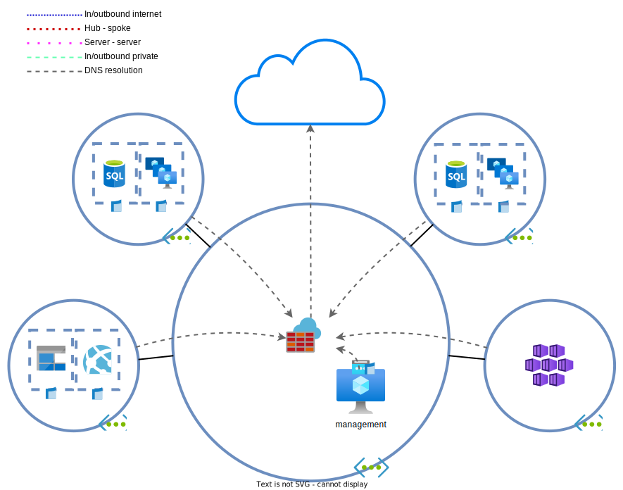
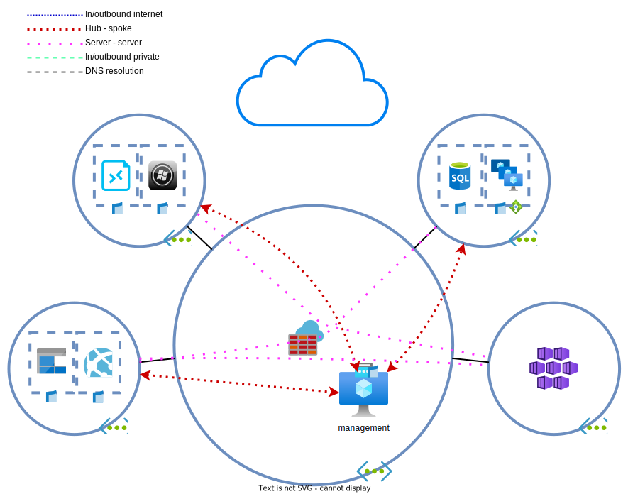

# Dag 2 - Firewalling

* [Uitrol AZF](#uitrol-azf)
* [Aanpassen interne routering](#aanpassen-interne-routering)
* [IP groups en network rules](#ip-groups-en-network-rules)
* [Aanpassing routering richting internet](#aanpassing-routering-richting-internet)
* [Inbound management verkeer repareren](#inbound-management-verkeer-repareren)
* [Opruimen lab](#opruimen-lab)

De afdeling wil alle DNS queries gelogd hebben. Omdat er misschien later nog wat gedaan gaat worden met `threat intelligence`/threat detection, wordt hiervoor de `Azure Firewall` gebruikt.

> **Note:** Start de VM's nog niet op als ze uit staan. We gaan de DNS instellingen aanpassen. Deze worden alleen bij het (her)starten van een VM meegenomen door DHCP, of na een renew in jouw besturingssysteem.

## Uitrol AZF

1. Deploy een [`Azure Firewall`](https://docs.microsoft.com/en-us/azure/firewall/overview). De reden hiervoor is dat er meteen een makkelijke NVA aanwezig is die ook als 'custom' DNS server/proxy kan dienen
    * Let op, een `AZF` heeft nog extra componenten nodig zoals een `subnet`. De subnet moet `AzureFirewallSubnet` heten en voor de deployment worden aangemaakt.
    * Standard tier
    * Firewall Policy management
    * Plaats het in de hub
    * Forced tunneling uit
1. De configuratie van de meeste instellingen gebeurt in de **`firewall policy`**. Configureer de firewall als [DNS proxy](https://docs.microsoft.com/en-us/azure/firewall/dns-settings).
    * DNS > Enabled
    * DNS Proxy > Enabled
    * DNS Servers > Gebruik Google DNS en Cloudflare DNS als DNS servers in plaats van de VNET default DNS.
1. Configureer de `AZF` interne/private IP als de [DNS server voor de VNETs](https://docs.microsoft.com/en-us/azure/virtual-network/manage-virtual-network#change-dns-servers).
    * Per VNET moet dit ingesteld worden.
    * Kan ook per NIC, maar daar heeft niemand tijd voor.
1. Configureer de `AZF` `Diagnostics settings`. Dit moet op de firewall zelf. Log alles naar de `Log Analytics Workspace` en `storage account`. Stel een retentie van 90 dagen in.
1. (Her)Start de VM's of voer de onderstaande commands uit om een renew te doen.
    * linux: `sudo dhclient -r && sudo dhclient`
    * windows: `ipconfig /renew`
1. Controleer de DNS instellingen die ze via DHCP hebben ontvangen.
    * linux: `resolvectl status`
    * windows: `Get-DnsClientServerAddress`
1. Probeer iets te resolven
    * linux: `dig google.com +short`
    * windows: `Resolve-DnsName google.com`

De `AZF` wordt nu gebruikt als DNS server/proxy.

> 

Threat intelligence

>
> Azure `firewall` kan gebruik maken van Microsoft's [`threat intelligence`](https://docs.microsoft.com/en-us/azure/firewall/threat-intel) om FQDNs en DNS queries te inspecteren. Hiervoor is wel nodig dat de firewall alle DNS queries kan onderscheppen. Hierom wordt gebruik gemaakt van de DNS proxy functionaliteit.

## Aanpassen interne routering

Zoals gewoonlijk, veranderen eisen na verloop van tijd. Nu blijkt dat de primaire en secundaire omgevingen met elkaar gegevens moeten kunnen uitwisselen. Een message queue is geen optie. De ontwikkelde communicatie methode is zo geschreven dat data uitwisseling direct tussen de hosts plaats moet vinden (al dan niet gerouteerd).

BY vindt een full-mesh VNET peering creeeren geen fijn idee (waarom?). Om verkeer tussen de spokes via de hub mogelijk te maken, kan er gebruik worden gemaakt van [`User Defined Routes`](https://docs.microsoft.com/en-us/azure/virtual-network/manage-route-table) en een `Network Virtual Appliance` (NVA): de `AZF`.

> 

Standaard route tabellen in Azure

>
> Azure `virtual networks` hebben [standaard een null route](https://docs.microsoft.com/en-us/azure/virtual-network/virtual-networks-udr-overview#default) staan voor de RFC1918 prefixes (10.0.0.0/8, 172.16.0.0/12, 192.168.0.0/16) en de RFC6598 prefix (100.64.0.0/10). Door een `address space` toe te voegen worden specifiekere routes aangemaakt en de route tabel overschreven.
>
> Directe `VNET peers` voegen elkaars `address spaces` toe. Geleerde routes worden echter niet doorgegeven aan andere peers. Dit betekent dat spoke A geen routes leert naar spoke B via het hub netwerk. Zelfs met een `user defined route` werkt dit niet. 

1. Maak een `UDR` voor de spoke netwerken aan met als destination jouw superscope (bijv. 10.128.0.0/14) en als next-hop de IP van de `AZF`.
1. Koppel de `UDR` aan de spoke `subnets`.
    > 

Koppelen UDRs

    >
    > `UDRs` kunnen worden gekoppeld aan meerdere VNETs, maar ze moeten zich in dezelfde regio en subscription bevinden. Je zult dus per regio een spoke `UDR` aan moeten maken. Denk in de toekomst hier aan. Hoe kun je standaard routetables voor alle VNETs aanbieden?

    

1. Controleer hoe de verkeersstromen lopen:
    * Verkeer tussen spokes en hub
    * Verkeer tussen spokes
    * Gebruik de `Effective routes` functionaliteit van een `NIC` of `Next hop` functionaliteit van de `Network Watcher`

    > 

Next hop/effective routes

    >
    > De [`Next hop`](https://docs.microsoft.com/en-us/azure/network-watcher/network-watcher-next-hop-overview) functionaliteit van de `Network Watcher` of de `Effective routes` functionaliteit van een `NIC` geeft informatie over waar verkeer van een VM naartoe gaat. Gebruik dit om verkeersstromen te verifieren.

    

    > 

ARP, traceroute en ping

    >
    > Azure virtual networking is geen standaard netwerken. Het is allemaal nep. Layer 1 en 2 bestaan niet. Pakketten worden van de ene `NIC` naar een andere `NIC` gekopieerd. De default gateway bestaat dus niet echt en is alleen aanwezig zodat VMs normaal functioneren.
    >
    > Controleer de ARP tabel. Hier zie je dat de MAC-adres van de default gateway opvallend is. De gateway is ook niet te pingen. Verder werkt traceroute niet zoals je verwacht. In een `VNET` laat de traceroute alle default gateways niet zien. `network virtual appliances` zijn wel zichtbaar.

    

1. Test het verbinden van een spoke VM naar een andere spoke VM. Werkt dit?
    * `curl http://<ip>`

    > 

Antwoord

    >
    > Dit werkt nog niet, omdat de AZF niet een router, maar een firewall is. Het verkeer moet dus worden toegestaan.
    > Verkeer van/naar de management server werkt wel, omdat dit de firewall omzeilt.

    

## IP groups en network rules

De `Azure Firewall` moet het verkeer van spoke naar spoke toestaan. Bij het aanmaken van regels kunnen IP adressen direct worden ingevoerd, maar het is (soms) handiger om gebruik te maken van `IP groups`. `IP groups` zijn niks anders dan objecten in andere firewalls.

1. Maak voor de spoke VM subnet elk een `IP group`.
1. Maak een `rule collection group` op de firewall policy aan en maak daar in weer een `network rule collection` in aan die verkeer tussen de spokes toe staan. Dit is standaard L4 firewalling.
    * Maak gebruik van `IP groups` om de sources en destinations aan te geven.
    * Verkeer tussen spokes zou nu moeten werken.

    > 

Rule collection verificatie

    >
    > De `Azure Firewall` heeft geen optie om te controleren of verkeer is toegestaan. Er moet dus in de logs worden gedoken. Als de `diagnostics settings` geconfigureerd zijn met een `Log Analytics Workspace`, kan gebruik worden gemaakt van de [`Logs` functionaliteit](https://docs.microsoft.com/en-us/azure/firewall/firewall-diagnostics#view-and-analyze-the-activity-log) van een `AZF` om toegestane en gedropte verkeer te bekijken.
    >
    > Ten tijde van schrijven is het bekijken van de logs in de `portal` vervelend. Met de integratie met Azure Sentinel krijgt Azure eindelijk een [single pane of glass](https://docs.microsoft.com/en-us/azure/firewall/firewall-workbook) voor netwerk verkeer. Dit valt echter buiten de lab en examen.

    

## Aanpassing routering richting internet

Vanuit het raad van bestuur komt het bericht dat verkeer van en naar het internet geanalyseerd moet worden voor threats. Ook hiervoor kan de `AZF` gebruikt worden.

1. Configureer `threat intelligence` zodat het daadwerkelijk verkeer blokkeert.
    
    > 

Threat intelligence

    >
    > `Threat intelligence` staat standaard aan op de `firewall policy`, maar in de alerting modus. Dit kan aangepast worden naar `none` of `alert and block`. De alerts worden weggeschreven naar de `Log Analytics Workspace`.

    

1. Pas de spoke `UDR` aan. Voeg een 0.0.0.0/0 route toe via de `AZF`.
1. Voeg een nieuwe `network rule collection/network rule` toe zodat outbound verkeer richting het internet toegestaan is vanuit de supernet op de `AZF`. 
    * Let op dat je niet alle interne verkeer open zet. Mogelijk moeten er meer regels/collections toegevoegd worden.
1. Controleer de externe IPs van de web servers. Dit zou gelijk moeten zijn aan (een van) de `public IP(s)` gekoppeld aan de firewall
    * linux: `curl https://api.ipify.org`
    * windows: `irm https://api.ipify.org`
    > **Note:** Zie Rule collection verificatie voor informatie.
1. Maak ook een `UDR` aan voor de hub. Deze moet ook een default route richting de `AZF` hebben. Koppel de `UDR` aan de management server `subnet`.
    * Heb je nog verbinding? Waarom wel/niet?

    > 

Antwoord

    >
    > Er is sprake van asymmetrische routering. Verkeer komt binnen via de [PIP]('' "Public IP"), maar gaat langs de AZF naar buiten. 
    >
    > De `AZF` doet [automatisch SNAT](https://docs.microsoft.com/en-us/azure/firewall/snat-private-range) voor destination IPs buiten RFC1918.

    

> 

Service tags en UDRs

>
> `Service tags` zijn lijsten van IP adressen die een dienst kan gebruiken. De lijst wordt bijgehouden door Microsoft. `Service tags` zijn te gebruiken in `network security groups`, `Azure Firewalls` en sinds kort ook `user defined routes`.

## Inbound management verkeer repareren

Om de asymmetrische routering te repareren, moet de inbound verkeer via de firewall lopen. We gaan dus via de firewall RDP verkeer NATten naar de management server.

1. Maak een NAT rule collection op de `AZF` aan voor inbound RDP of SSH (Windows of Linux) richting de management server.
    * Sta dit toe alleen vanuit jouw lokale IP.

    > 

NAT rule collections

    >
    > `NAT rule collections` maken onder water voor elke match een [tijdelijke `network rule` aan](https://docs.microsoft.com/en-us/azure/firewall/rule-processing#nat-rules). Hierdoor is het niet nodig om handmatig `network rules` te genereren.

    

1. Voeg een nieuwe `network rule collection` toe zodat outbound verkeer toegestaan is vanuit de hub. Gebruik hier optioneel een `IP group`.
1. Verwijder de publieke IP van de management server.
1. Controleer of inbound verkeer werkt. Gebruik hiervoor de externe IP van de `AZF`.
    > 

RDP werkt niet

    >
    > Afhankelijk van de NSG instellinge kan RDP nog steeds niet werken. Indien RDP alleen vanuit jouw IP is toegestaan en al het overige inbound verkeer geblokkeerd wordt, zal dit het geval zijn. De `AZF` doet naast DNAT ook SNAT voor inbound verkeer. De reden hiervoor is simpel: het verkeer moet symmetrisch lopen.
    > 
    > Hierdoor is de source van het verkeer een `AZF` instance IP en niet de load balanced IP. Je zal dus verkeer toe moeten staan van de gehele 'AzureFirewallSubnet' reeks. Het is onmogelijk om te weten vanuit welke instance in dat subnet het verkeer af komt.

    

1. Controleer de nu gebruikte externe IP.
1. Test de `threat intelligence` door de volgende website te bezoeken vanuit de management VM:
    * `https://testmaliciousdomain.eastus.cloudapp.azure.com`

> **Note:** de bovenstaande URL werkt niet meer.

> **Optioneel:** configureer een [DNS record](https://docs.microsoft.com/en-us/azure/virtual-network/public-ip-addresses#dns-hostname-resolution) op de `public IP` van de firewall.

## Opruimen lab

Het is het gemakkelijkst en goedkoopst om het lab z.s.m. op te ruimen wanneer het niet meer nodig is en [opnieuw uit te rollen](../README.md#lab-checkpoints) via de bijgevoegde [Terraform bestanden](./tf/).

Indien je het lab wilt behouden, kun je de onderstaande stappen uitvoeren. Anders mag het lab worden opgeruimd.
* VMs uitschakelen
* Azure firewall policy behouden
* Azure firewall verwijderen
    * Public IPs behouden
    * Voor het volgende lab moet de firewall opnieuw uitgerold worden
