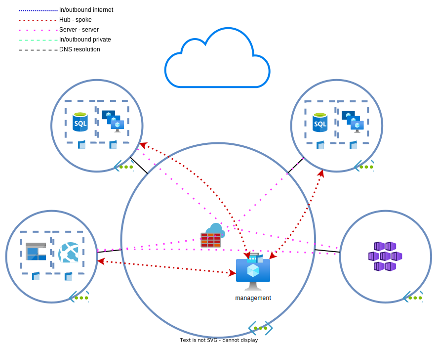
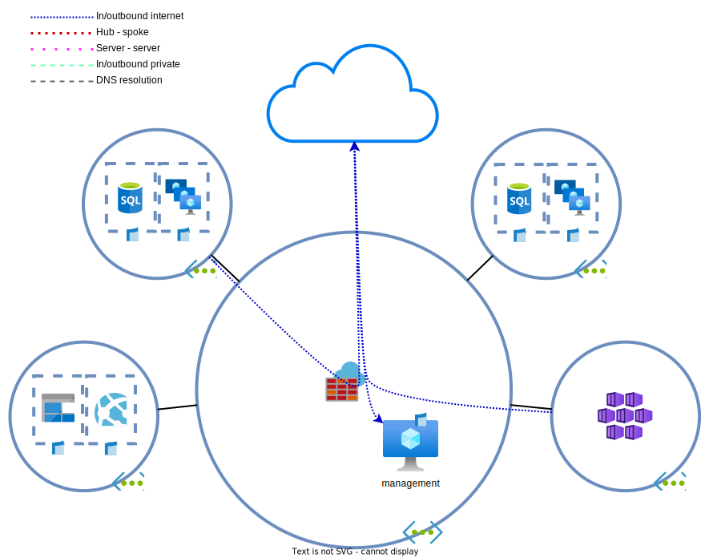

# Day 2 - Firewalling

* [Azure firewall deployment](#azure-firewall-deployment)
* [Internal routing change](#internal-routing-change)
* [IP groups and network rules](#ip-groups-and-network-rules)
* [Internet routing update](#internet-routing-update)
* [Inbound management traffic repair](#inbound-management-traffic-repair)
* [Lab clean-up](#lab-clean-up)

The security department wants to have `threat intelligence`/threat detection capabilities and want to start by logging and inspecting all DNS queries. For this reason, the `Azure Firewall` will be used as DNS proxy.

> **Note:** Don't start the VMs yet if they aren't running. We're going to change VNET DNS settings. Changes to the VNET DNS settings. VMs in Azure by default use static DHCP and only pick up changes after a reboot or by telling the DHCP client in the OS to renew.

## Azure firewall deployment

1. Deploy an [`Azure firewall`](https://learn.microsoft.com/en-us/azure/firewall/overview) in the hub network. It will serve as an NVA with DNS server/proxy capabilities and can perform threat inspection.
    * Place it in the hub
    * The `AZF` requires some other resources to function, such as a subnet with the name `AzureFirewallSubnet`. This subnet must exist before you start the firewall deployment.
    * Standard tier
    * Firewall Policy management
    * Turn off forced tunneling
1. Most of the firewall configuration will happen in the **`firewall policy`**, not on the firewall itself. Configure the firewall as a [DNS proxy](https://learn.microsoft.com/en-us/azure/firewall/dns-settings).
    * DNS > Enabled
    * DNS Proxy > Enabled
    * DNS Servers > Use Google DNS and Cloudflare DNS as DNS servers in place of the `VNET` default DNS.
1. Configure the `AZF` internal/private IP as the [DNS server for the `VNETs`](https://learn.microsoft.com/en-us/azure/virtual-network/manage-virtual-network#change-dns-servers).
    * This has to be configured per `VNET`
    * It can be configured on each `NIC`, but ain't nobody got time for that
1. The firewall now has the capability to see DNS requests, but isn't logging them. Configure the `AZF` `Diagnostics settings`. This has to happen on the firewall, **NOT** the firewall policy. Log everything to the `Log Analytics Workspace` and `storage account`. Configure a retention of 90 days.
1. (Re)Start the VMs or run the below commands to perform a DHCP renew.
    * linux: `sudo dhclient -r && sudo dhclient`
    * windows: `ipconfig /renew`
1. Check the DNS settings received by DHCP.
    * linux: `resolvectl status`
    * windows: `Get-DnsClientServerAddress`
1. Try to resolve some addresses.
    * linux: `dig google.com +short`
    * windows: `Resolve-DnsName google.com`

The `AZF` can now be used as a DNS proxy. Visit some websites on the management server. Then go to the `firewall` > `logs` > `Firewall logs` > `Azure Firewall DNS proxy logs data` > `Run`. Here you can see DNS queries.

> 

Threat intelligence

>
> The Azure `firewall` can make use of Microsoft's [`threat intelligence`](https://learn.microsoft.com/en-us/azure/firewall/threat-intel) capabilities to inspect FQDNs and DNS queries.

## Internal routing change

As usual, requirements change over time and the network has to support business needs.

One of the changes is that the API must be able to replicate data between the primary and secondary region. Sadly, a message queue isn't an option. The developed replication method requires that data is directly exchanged between hosts (even if routed).

Creating a full-mesh of VNET peers isn't something that BY wants to do (why?). The solution the architects are gravitating to is to use a `network virtual appliance` and [route tables`](https://learn.microsoft.com/en-us/azure/virtual-network/manage-route-table) to route traffic via the hub.
The AZF can function as the `NVA` doing the routing.

> 

Default system route tables in Azure

>
> Azure `virtual networks` contain default [null routes](https://learn.microsoft.com/en-us/azure/virtual-network/virtual-networks-udr-overview#default) for RFC1918 prefixes (10.0.0.0/8, 172.16.0.0/12, 192.168.0.0/16) and the RFC6598 prefix (100.64.0.0/10). By adding `address spaces` to a `VNET`, more specific routes are added to the default route table.
>
> Direct `VNET peers` add each other's `address spaces` to their system route tables. Routes learned for a peer are not passed on to other peers. This means that spoke A won't learn spoke B routes via the hub peering.

1. Create a `route table` with a `UDR` for the spoke networks.
    * Use the /14 superscope as destination
    * Use the `AZF` private IP as next-hop
1. Attach the `route table` to the spoke `subnets`.
    > 

Attaching UDRs

    >
    > `Route tables` can be attached to multiple VNETs, but the VNETs must be in the same region and subscription as the `route table`. Each region'll require a separate spoke `route table`.

    

1. Verify the traffic flows:
    * Traffic between the spokes and hub
    * Traffic between the spokes
    * Use the `Effective routes` functionality of `NIC` or `Next hop` functionality of the `Network Watcher`

    > 

Next hop/effective routes

    >
    > The [`Next hop`](https://learn.microsoft.com/en-us/azure/network-watcher/network-watcher-next-hop-overview) feature of the `Network Watcher` and the `Effective routes` functionality of a `NIC` provide information on the path a packet will take. Use these two tools to verify traffic flows.

    

    > 

ARP, traceroute and ping

    >
    > Azure virtual networking is not real networking. It's basically fake.Layer 1 and 2 don't really exist in a `VNET`. Packets within a host are basically copied from `NIC` to `NIC` after passing SDN policies. 
    >
    > There is no real default gateway for example. It's only there so no VM network stacks need to be modified. If you check a system's ARP table, the default gateway will have a peculiar mac address.
    >
    > The traceroute/tracert command will also not function as expected. As the default gateways are fake, they will be skipped in the outpur. `NVAs` will be visible.

    

1. Test the HTTP connection from spoke to spoke server. Does this work?
    * `curl http://<ip>`

    > 

Answer

    >
    > This doesn't work yet. The `AZF` is a firewall, not a router. The ACLs need to be configured before any traffic is forwarded. 
    > Traffic between the API servers and the management server works as thos packets don't pass the `Azure firewall`.

    

## IP groups and network rules

We need the `Azure firewall` to pass traffic between the spokes. When creating rules, IP-addresses/prefixes can be used as sources and destinations. However, sometimes it's more efficient to use `IP groups`. `IP groups` are basically what is known as objects in most other firewalls

1. Create an `IP group` for each spoke VM subnet.
1. Create an `IP group` for assigned /14 supernet.
1. Create a `rule collection group` on the `firewall policy`.
1. Add a `network rule collection`. This is a L4 firewall solution. 
    * Allow spoke to spoke traffic.
    * Use the `IP groups` as source and destination.

Traffic between spokes should now work. Generate some traffic between the spokes.

> 

Rule collection verification

>
> The `Azure Firewall` has no option to check if traffic is allowed. The way to check traffic is by inspecting the logs. Use the [`logs` functionality](https://learn.microsoft.com/en-us/azure/firewall/firewall-diagnostics#view-and-analyze-the-activity-log) of a firewall if the `diagnostics settings` are configured with a `log analytics workspace`.
>
> The steps are the same as the DNS logs.
>
> As of the time of writing, there is no easier way to view the logs in the `portal`. `Azure Sentinel` and `Azure workbooks` provide more of a [single pane of glass](https://learn.microsoft.com/en-us/azure/firewall/firewall-workbook) for network traffic through the Azure firewall. This isn't part of the exam (for now).

## Internet routing update

A mandate has come down from the board of directors that all traffic to and from the internet must be analyzed for threats. This is a task that can be performed by the `AZF`.

1. Configure `threat intelligence` to not only alert, but also block data.
    
    > 

Threat intelligence

    >
    > `Threat intelligence` is enabled by default on the `firewall policy`, but in alerting mode. This can be changed to `None`/`Disabled` or `Alert and block`. The logs will be written to the `Log Analytics Workspace`.

    

1. Update the spoke `route table`. Add a 0.0.0.0/0 route via the `AZF`.
1. Add a new `network rule collection/network rule` to allow outbound traffic to the internet.
    * Make sure to not allow all internal traffic. It is possible that more `network rule collections` are needed.
1. Check the external IPs of the API servers. These should be (one of the) IP(s) attached to the firewall.
    * linux: `curl https://api.ipify.org`
    * windows: `irm https://api.ipify.org`
    > **Note:** See Rule collection verification for more information.
1. Add a `route table` to the hub management server subnet. This `route table` should contain a `UDR` with a default route towards the `AZF`.
1. Do you still have a connection to the management server? Why?

    > 

Answer

    >
    > There is assymetric routing happening. Traffic arrives via the management server [PIP]('' "Public IP"), but return traffic is routed via the Azure firewall.
    >
    > The `AZF` performs [automatisch SNAT](https://learn.microsoft.com/en-us/azure/firewall/snat-private-range) for any destination outside the RFC1918 range.

    

> 

Service tags en UDRs

>
> `Service tags` are lists of IP addresses for Microsoft services, maintained by Microsoft. `Service tags` can be used in `network security groups`, `Azure Firewalls` and `user defined routes`.

## Inbound management traffic repair

To fix the asymmetric routing, inbound RDP traffic has to pas the firewall. The AZF will be performing NAT to allow traffic arriving at tcp/udp port 3389 to reach the management server.

1. Create a `NAT rule collection` on the `Azure firewall policy` for inbound RDP towards the management server.
    * Perform the NAT only on traffic originating from your local public IP address towards the firewall `public IP`.

    > 

NAT rule collections

    >
    > `NAT rule collections` create a [temporary `network rule`](https://learn.microsoft.com/en-us/azure/firewall/rule-processing#nat-rules) for each match. Because of this, it's not needed to to manually add `network rules`.

    

1. Add a new `network rule collection` to allow outbound traffic from the hub. Try to use `IP groups` where possible.
1. Remove the `public IP` from the management server.
1. Check if inbound RDP traffic is working. Use the external IP of the `AZF` as destination.
    > 

If RDP isn't working

    >
    > RDP may still not work depending on the `NSGs`' configurations. If RDP is allowed only from your home IP address, all other inbound RDP will be blocked. The `AZF` always performs SNAT for inbound traffic from the internet. The reason is simple: to make sure that traffic isn't flowing assymmetrically. 
    > 
    > Because of the SNAT, the traffic will appear to originate from an `Azure firewall` instance's IP. It will not appear to originate from the load balanced IP. As the instance IP can be any IP in the `AzureFirewallSubnet`, the whole subnet must be allowed as source.

    

1. Check the management server's external IP.
1. Test the `threat intelligence` feature by visiting the following website from the management server:
    * `https://testmaliciousdomain.eastus.cloudapp.azure.com`

> **Note:** It seems that the above service doesn't work anymore.

> **Optional:** Configure a [DNS record](https://learn.microsoft.com/en-us/azure/virtual-network/public-ip-addresses#dns-hostname-resolution) on the `public IP` of the firewall.

## Lab clean-up

If you're not continuing to the next exercises, it's easier and cheaper to delete the lab when done. The end state of this lab can be [redeployed](../README_EN.md#lab-checkpoints) via the included [Terraform files](./tf/).

In case you do want to keep the lab, it's possible to minimize costs by performing the following steps: 
* Shut down the VMs
* Keep the Azure firewall policy
* Remove the Azure firewall
    * Keep the public IPs
    * The firewall has to be redeployed before starting the next lab.
