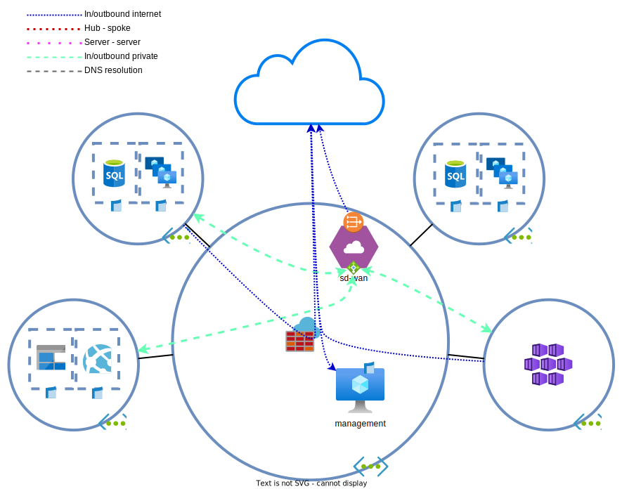

# Dag 3 - SD-WAN implementatie en NAT Gateway

BY Verzekeringen heeft ook SD-WAN uitgerold over alle branch offices. Hun oplossing werkt niet samen met `Azure Virtual WAN`. Om deze reden moet er een `network virtual appliance` (`NVA`) uitgerold worden en moeten de netwerken zo aangepast worden dat de onderstaande netwerken via de appliance gerouteerd worden.

| locatie | subnetten | 
| --- | --- | 
| Nederland | 10.192.0.0/22 |
| Ierland | 10.192.4.0/22 |

## NVA uitrollen

> **NOTE:** Hoewel er voor het lab maar een apparaat wordt uitgerold, gaan we het behandelen alsof het in een active/passive opstelling draait

We gaan een SD-WAN NVA uitrollen in het hub netwerk.

1. Maak een subnet voor de NVAs aan in het hub netwerk. Koppel een NSG aan de NVA die **alle** verkeer toe staat, niet alleen `VirtualNetwork` naar `VirtualNetwork`
    > 

NSGs en NVAs

    >
    > De meeste NVAs kunnen ook firewallen. Het is vaak niet nodig om de data poorten te firewallen. Subnetten/interfaces waar HA en management verkeer overheen lopen moeten wel gefilterd worden.
    > 
    > In pricipe zou je af kunnen zonder een NSG. Er moet echter een interne `Azure Load Balancer` (`ALB`) komen om verkeer naar de actieve node te sturen. Standard `ALBs` (niet Basic) [vereisen dat er een NSG actief is](https://docs.microsoft.com/en-us/azure/load-balancer/load-balancer-overview#securebydefault) voordat ze verkeer door laten

    

1. Rol een Ubuntu 22.04 VM in de hub.
    * Rol de VM in `West Europe` uit.
    * Rol de VMs in een `availability zone` uit.
    * Geef de VMs geen `public IP`.
    * Schakel `Auto-shutdown` in en zet deze op 00:00 in jouw lokale tijdzone.
    * Bij de `Advanced` tab tijdens de configuratie kan een custom script worden ingevoerd. Kopieer de inhoud uit de [cloud init file](./tf/data/cloud-init.yml) in de **CUSTOM DATA**, niet **USER DATA**.
1. Pas alle `UDRs` aan zodat verkeer richting de bovenstaande subnetten via de `SD-WAN NVA` appliance loopt.
1. Probeer vanuit de management server de IP adressen te pingen.
    > 

IP Forwarding

    >
    > VMs in Azure mogen over het algemeen niet routen. Om dit mogelijk te maken moet op de netwerkkaarten die routeren [`IP forwarding`](https://docs.microsoft.com/en-us/azure/virtual-network/virtual-networks-udr-overview#user-defined) op `Enabled` staan onder `IP configurations`.

    

1. Om TCP te testen, is er ook een intranetpagina geconfigureerd op de appliance. Probeer ook de HTTP pagina op de SD-WAN IP-reeksen te bekijken.

## Load balancing voor HA

Onder normale omstandigheden wordt er gebruik gemaakt van een high available opstelling. In Azure is het niet mogelijk om met (gratuitous) ARPs IP-adressen te verhuizen tussen hosts. De twee opties zijn:
1. Via de API. Failovers tot 2 minuten
1. Via een load balancer. Failovers standaard tot 10 secondes

> 

Intern of publiek?

>
> Afhankelijke van hoe verkeer geinitieerd wordt heb je andere typen load balancers nodig:
> * Verkeer vanuit intern: interne load balancer
> * Verkeer vanuit extern: externe load balancer
>
> Firewalls zullen vaak beide typen loadbalancers hebben.

Voor deze configuratie maken we een enkele interne load balancer, omdat de SD-WAN apparaat alleen een VPN opzet naar buiten.
1. Maak een loadbalancer aan via de portal
    * Gebruik de `Standard` SKU.
    * Kies voor de type `Internal`
1. Maak een `Frontend IP configuration` aan. Dit is een IP adres waarop verkeer op de `LB` binnen komt. Een `load balancer` kan meerdere hebben.
    * Plaats het in dezelfde subnet als de SD-WAN `NVAs`.
    * Kies voor een zone redundant load balancer
    > 

Zone redundancy

    >
    > Wat voor type [redundancy](https://docs.microsoft.com/en-us/azure/load-balancer/load-balancer-standard-availability-zones) je kiest hangt af van je eisen en applicatie architectuur. In de meeste gevallen is `zone-redundant` voldoende.
    >
    > Als je echter verkeer binnen in een zone moet houden (door bijvoorbeeld latency), kan het kiezen van specifieke zones voordelen hebben
    
    

1. Maak een `Backend pool` aan. Dit is een pool van hosts waar verkeer naartoe gestuurd kan worden. Voeg hier de SD-WAN appliance aan.
1. Maak een inbound rule aan.
    * Vink `HA Ports` aan. HA ports zijn alleen beschikbaar op Standard interne load balancers en Gateway load balancers. Hierdoor wordt al het verkeer doorgezet naar de backend pool.
    * Maak een nieuwe health probe aan
        * Veel `NVAs` hebben een manier om hun health te laten proben. Dit is maar een Linux VM en de beste service is SSH op poort TCP/22
    * Schakel `Floating IP` in. 
    > 

Floating IP/Direct Server Return

    >
    > Azure kent het concept van een floating IP niet. Gratuitous ARPs kunnen niet in een VNET. Zelfs normale ARPs worden niet gebroadcast maar gevijnsd door de onderliggende hypervisors. Een ander IP adres configureren in de `VM` dan dat geconfigureerd is op de `NIC` via de portal, maakt het mogelijk onbereikbaar.
    >
    > Om dit toch mogelijk te maken, kan een `load balancer` gebruikt worden met floating IP/Direct Server Return aan. Hiermee voert de LB geen DNAT uit. De frontend IP wordt as-is doorgegeven aan de achterliggende `VMs`. 
    >
    > Dit betekent dat de `VMs` de IPs moeten accepteren. Voor een firewall kan dit in de vorm zijn van een VIP. In een Windows Failover Cluster is dit een cluster IP.

    

Het is belangrijk om diagnostics in te schakelen voor load balancers. Zonder diagnostics settings is het moeilijk om te zien of de load balancer correct werkt (e.g. is een server up/down in de backend pool).

1. Schakel na het aanmaken van de load balancer, diagnostics settings in.
    * Houd je aan de eisen van de Hollandsche Bank: 30 dagen doorzoekbaar (`log analytics`) en 90 dagen archivering (`storage account`).
    > 

Health probe status

    >
    > In de Azure portal is er geen makkelijke manier om de health status van de achterliggende servers te zien. De beste methode is om de metrics van de load balancer te gebruiken. Bij het openen van de metrics, kan voor de 'Metric' `Health Probe Status` gekozen worden. 
    > 
    > Om vervolgens per apparaat de health status te zien, kan gebruik worden gemaakt van `splitting`. Na het klikken op `Apply Splitting` kan als value `Backend IP Address` gekozen worden. Dan zie je de status en geschiedenis van elke server in een backend pool.

    

1. Controleer de internet verbinding van de SD-WAN appliance.
    * `curl https://api.ipify.org`

> 

Interne load balancers en outbound connectivity

>
> Indien alleen een standard internet load balancer (niet basic) aan een VM gekoppeld wordt, v[erliest het de mogelijkheid om met het internet te verbinden](https://docs.microsoft.com/en-us/azure/load-balancer/load-balancer-troubleshoot#no-outbound-connectivity-from-standard-internal-load-balancers-ilb). Dit is een veiligheidsinstelling van Azure. Om het toch outbound connectivity te hebben, kan er gekozen worden om een externe load balancer of een public IP toe te voegen. De betere oplossing is echter een NAT Gateway. 

## NAT Gateway

We gaan een NAT Gateway (NGW) uitrollen en deze koppelen aan de SD-WAN subnet. `NGWs` hebben het [voordeel](https://docs.microsoft.com/en-us/azure/virtual-network/nat-gateway/nat-gateway-resource) dat ze NAT translaties aanmaken op basis van source en destination IPs en poorten, en protocol. Hierdoor kan per `public IP` meer dan de verwachtte 65535 translaties/sessies worden opgezet.

Het is simpel om een gateway bij elkaar te klikken, maar indien nodig kan naar de [documentatie](https://docs.microsoft.com/en-us/azure/virtual-network/nat-gateway/quickstart-create-nat-gateway-portal) gerefereerd worden. 
1. Let bij het uitrollen van de `NGW` op de volgende punten:
    * Zone redundancy
    * Idle timeout: Hoe lang een sessie zonder verkeer actief wordt gehouden
2. Controleer de outbound connectivity van de SD-WAN appliance.
    * `curl https://api.ipify.org`
    * Vergelijk dit met de `NGW` IP.

## Routeren richting SD-WAN LB

De SD-WAN appliance heeft weer outbound connectivity, maar het verkeer loopt nu nog direct via de VM, in plaats van via de `ILB` die de high-availability verzorgt.

De `UDRs` verwijzen naar de directe IP van de NVA. Om goed HA in te richten, moet het verkeer via de load balanced IP lopen.
1. Pas alle `UDRs` aan zodat het verkeer via de loadbalancer verloopt.
1. Test verkeer naar de achterliggende IPs door pings uit te voeren.

> 

Active/Active cluster

>
> Een standard load balancer werkt prima voor een active/passive cluster. Wanneer active/active clusters nodig zijn, kan er asymmetrisch verkeer optreden bij north-south verkeer.
>
> Dit is op te lossen door naast DNAT, ook SNAT op de NVA te doen of een cluster mechanisme te gebruiken om verkeer altijd naar de juiste node te leiden.
>
> Beide opties hebben nadelen. Een fijnere optie kan zijn om de [`gateway load balancer`](https://docs.microsoft.com/en-us/azure/load-balancer/gateway-overview) of `route server` te gebruiken. De `gateway load balancer` zorgt ervoor dat north-south verkeer altijd symmetrisch loopt. Jammer genoeg heeft het (nog) geen ondersteuning voor east-west verkeer. De `route server` wordt later in het lab behandeld.

