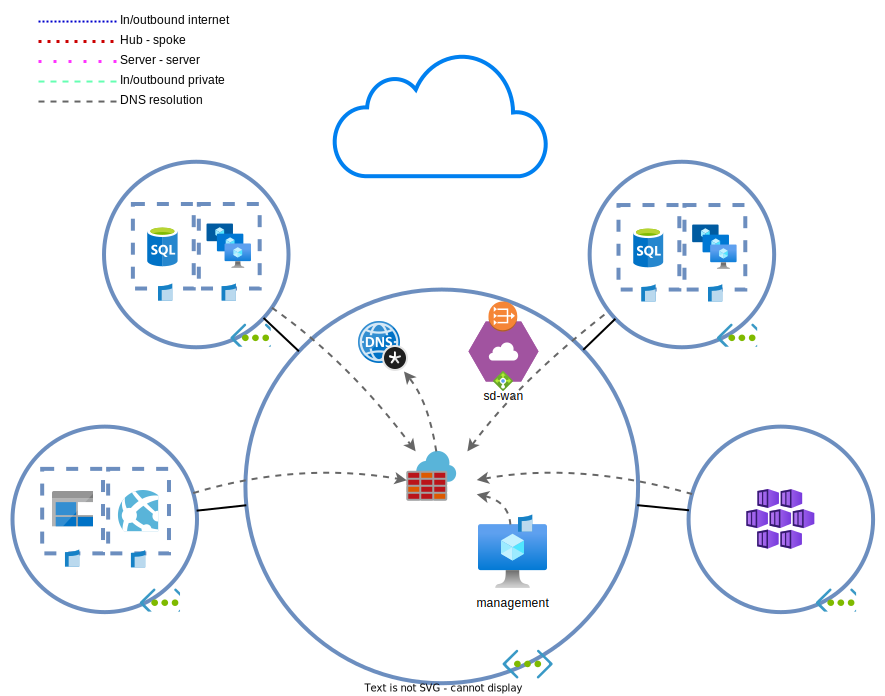
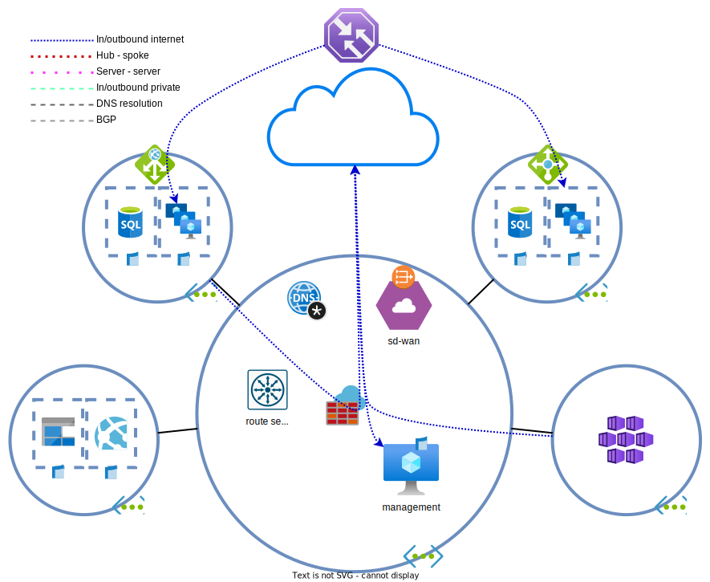

# Day 4 - Load balancing and DNS

* [Private DNS zones](#private-dns-zones)
* [Application gateway](#application-gateway)
* [Load balancing](#load-balancing)
* [Traffic Manager](#traffic-manager)
* [Lab clean-up](#lab-clean-up)

The environment is getting more expansive and having to remember IP addresses is getting harder. A solution for this DNS. 

The API servers must also be made available externally. For the primary environment, an `application gateway` (`AGW`) will be used. The secondary environment will use an `Azure load balancer` for inbound external connectivity.

## Private DNS zones

The architects have chosen to use [private DNS zone`](https://learn.microsoft.com/en-us/azure/dns/private-dns-privatednszone) to host their internal DNS zones. The zone should register all deployed VMs automatically to reduce the risk of configuration errors. All DNS requests have to continue going through the `AZF` for inspection.

The zone will be named `by.cloud`.

1. [Create](https://learn.microsoft.com/en-us/azure/dns/private-dns-getstarted-portal) a `private DNS zone`.
1. [Attach](https://learn.microsoft.com/en-us/azure/dns/private-dns-virtual-network-links) the DNS Zone to each VNET where [`auto registration`](https://learn.microsoft.com/en-us/azure/dns/private-dns-autoregistration) is desired (hub and both spokes).
    * Via private DNS zone > Virtual network links > Add
    * Turn on `auto registration`

    > 

Auto-registration

    >
    > `Auto registration` is a handy feature, but each zone can only be attached to [100 `VNETs`](https://learn.microsoft.com/en-us/azure/azure-resource-manager/management/azure-subscription-service-limits#azure-dns-limits) if the the feature is enabled.
    >
    > A `VNET` with a DNS zone with `auto registration` enabled can only have that zone attached.

    

1. Check in the DNS zone overview if the `VMs` are registered. If not, wait until all `virtual machines` have registered themselves in the zone.
1. Resolve some of the servers:
    * linux: `dig <host>.by.cloud`
    * windows: `Resolve-DnsName <host>.by.cloud`
1. This [doesn't work](https://learn.microsoft.com/en-us/azure/virtual-network/virtual-networks-name-resolution-for-vms-and-role-instances#name-resolution-that-uses-your-own-dns-server), why?

    > 

DNS resolution

    >
    > Zones attached to a `VNET` can only be resolved by using the `VNETs` built-in DNS server. The built-in DNS server is available on 168.63.129.16 for all VNETs. No `VNET`/on-prem network can use the DNS server of another `virtual network`. 
    >
    > All `VNETs` use the `AZF` DNS server. The `AZF` doesn't forward traffic to the network's DNS server, but CloudFlare DNS and Google DNS. This means that the zone is unresolveable for now. To fix this situation, have the firewall forward DNS requests to the `VNET` DNS.
    >
    > As of the time of writing, it's neccessary to deploy custom DNS servers in Azure to resolve `private DNS zones` from outside attached `VNETs`. Soon, the [`Azure DNS Private Resolver`](https://learn.microsoft.com/en-us/azure/dns/dns-private-resolver-overview) will be released which may make custom DNS servers unnecessary.
    >
    >**The only reason the private DNS zone is attached to the spokes, is for auto registration, not for DNS resolving.**

    

6. Edit the `AZF` DNS settings so private DNS resolving works. **Don't** change the the `VNET` DNS settings.

## Application gateway

The application in spoke A, the primary region, has to be made available externally. There are a few options:
* Public IP attached to the instance(s)
* Exposing the service via the Azure Firewall to the internet (albeit with an internal load balancer)
* Use an external/public `load balancer`
* Use an `application gateway` (`AGW`)

The application must be deployed in a secure manner and the BY security team wants to pilot with the [`AGW`](https://learn.microsoft.com/en-us/azure/application-gateway/overview) and the L7 (WAF) security.

> **NOTE:** No WAF functionality will be configured or used here. The setup isn't straightforward and may consume time. Also, `AGWs` with WAF functionality are more expensive.

> **NOTE:** The location for `AGWs` is dependent on the organization and architecture. For this lab we've chosen to run [AGW and AZF parallel](https://learn.microsoft.com/en-us/azure/architecture/example-scenario/gateway/firewall-application-gateway#firewall-and-application-gateway-in-parallel) to each other. This is one of the easier solutions with fewer downsides. Read the linked documentation to see other architectural options. In the parallel option its possible to deploy the gateway centrally for usage in multiple VNETs.

1. Configure the `application gateway`.
    * Determine where you want to deploy the `AGW`. Hub or spoke A, both are valid options.
    * Select a v2 application gateway
    * Check the *frontend IP configuration*
    * Create a *listener* and *backend pool*. Add the spoke A VM(s) into the backend pool.
1. (Optional) After deploying the gateway, a custom health probe can be created. This isn't needed, but allows for more accurate health checks.
    * Create a custom health probe to check the server health. There is a health check on the server's `/health/` API endpoint which returns a `HTTP 200 OK` with the following content `{"health": "ok"}`. 
        * protocol: Http
        * pick host name from backend http settings: true
        * path: `/health/`
        > **NOTE:** If you've chosen the *HTTP* health check, the trailing '/' is required.
    * Attach the health probe to the *HTTP setting*.

1. Configure the `diagnostics settings` according to the DHB standards.
1. Visit the webserver/API through the management server. Use the FQDN attached to the `public IP` of the `AGW`.
    > **NOTE:** Depending on the chosen type of *session persistence*, you may encounter only one or different hosts. As we have only one VM, you'll always encounter the single host.
1. Create a DNS CNAME record in the `private DNS zone` for the `AGW` A record.
    > **NOTE:** This CNAME cannot be resolved outside of the virtual network. Its only resolveable within the network.
1. Test the spoke A API server via AGW by using the AGWs IP and (custom) DNS record.
    > 

Health probe status

    >
    > It's easier to view the `application gateway`'s health probe statusses of servers in pools. There is a section named `Backend health` that displays an overview of statusses.

    

1. What is the difference between inbound and outbound internet traffic to and from the spoke A webserver?

## Load balancing

The application in spoke B has to be made redundant as well. `Application gateways` are expensive and having those running while idle is not a cost BY is willing to incur. For this reason an external `public load balancer` was chosen for external inbound connectivity. The configured [`load balancer`](https://learn.microsoft.com/en-us/azure/load-balancer/load-balancer-overview) must be configured to divide the load and to remove a server from the pool if the application isn't healthy.

1. [Deploy](https://learn.microsoft.com/en-us/azure/load-balancer/quickstart-load-balancer-standard-public-portal#create-load-balancer) a `load balancer`.
    * Type: Public
    * SKU: Standard (Basic cannot be used as the VMs use `availability zones`)
    * IP address assignment: Dynamic
1. Configure the `load balancer`.
    * Check the frontend IP configuration settings
    * Create a backend pool. Add the spoke B VM(s) to it.
    * Create a sensible health probe for the server. The server has a health check on the `/health/` API endpoint.
    > **NOTE:** If you've chosen the *HTTP* health check, the trailing '/' is required.
    * Create a load balancing rule.
    * Session persistence: [Any](https://learn.microsoft.com/en-us/azure/load-balancer/distribution-mode-concepts)

1. Configure the `diagnostics settings` according to the DHB standards.
1. Try to visit the webserver/API via the management server. Does it succeed? Can you think of why this is the case?
    > 

External load balancers

    >
    > The Azure ELB's perform DNAT, but no SNAT. In contrast to the `AGW`, it has no internal IP address and isn't attached to your internal network. When the server receives this traffic, it will respond to the original source, using its best path. In this case, the used route is the default route via the Azure Firewall. This causes asymmetric traffic which are blocked by firewals.
    > 
    > This can be solved by routing traffic in the [following way](https://learn.microsoft.com/en-us/azure/firewall/integrate-lb#public-load-balancer): 
    > * Azure Firewall PIP
    > * DNAT to ELB PIP
    > * ELB load balances traffic to the server
    > * Server has UDR for AZF PIP directly to the internet instead 
    >   * Azure SDN SNAT the server IP back to the ELB IP
    >   * AZF SNATs the IP and forwards it to the client
    > 
    > This is somewhat silly and I cannot think of a reason to ever deploy them like this.

    

Choose one of the below options to solve the issue:
1. Perform the steps as outlined in the Microsoft documentation.
1. Remove the ELB and NAT traffic from the AZF to the internal IP of the spoke B webserver.
1. Remove the ELB and NAT traffic from the AZF towards an internal load balancer fronting the spoke B webserver.

## Traffic Manager

BY wants all traffic to enter the `West Europe` API servers, unless there an outage in the region or traffic needs to be failed over from the primary region. In those cases, traffic needs to be directed to `North Europe`. The best solution for this is to use `Traffic Manager profiles`.
[`Traffic Manager`](https://learn.microsoft.com/en-us/azure/traffic-manager/traffic-manager-overview) is a DNS `load balancer` that can load balance clients on a global scale. `TM` does not route the traffic. It only points clients to an endpoint. It is quite handy for load balancing between datacentra. 

1. Create a new `Traffic Manager profile`.
    * [Routing method](https://learn.microsoft.com/en-us/azure/traffic-manager/traffic-manager-routing-methods): Priority
    * Reduce the *probing interval* to 10 seconds (makes testing easier).
    > 

Routing Methods

    >
    > The routing methods determine which client contact which endpoint.
    >    * priority: for an active/passive or primary/backup setup
    >    * weighted: divides the traffic based on the ratio of the weight
    >    * performance: sends traffic to the best performing server, as seen from the user's perspective.
    >    * geographic: sends clients from specific regions to specific endpoints.
    >    * multivalue: returns multiple endpoints instead of a single one.
    >    * subnet: sends clients from specific (public) subnets to specific subnets.

    

1. Go to Traffic Manager > Endpoints and add a new endpoint.
    * Use Azure endpoints and choose the AGW IP.
1. Repeat this for the AZF PIP.
    * Make sure the to assign it a higher metric than the AGW IP. This makes the AGW more preferred.
1. Test the browsing to the website from an external client by using the `Traffic managers` DNS name, visibile under 'Overview'.
    * Turn off the VM in spoke A and check if traffic gets redirected to spoke B.
1. Optional: Play around with the routing method. If need be, use web proxies to generate traffic from other regions.

> **NOTE:** Under normal circumstances a CNAME is created in your domain referencing the `Traffic manager` FQDN and the `TM` FQDN isn't directly accessed. 

## Lab clean-up

If you're not continuing to the next exercises, it's easier and cheaper to delete the lab when done. The end state of this lab can be [redeployed](../README_EN.md#lab-checkpoints) via the included [Terraform files](./tf/).
