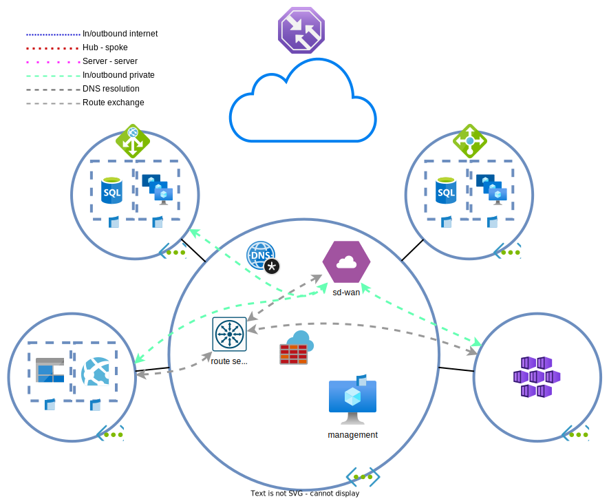

# Dag 5 - Route server en Bastion

Het gaat goed met BY Verzekeringen. Naast Nederland en Ierland, worden nu ook kantoren in het Verenigd Koninkrijk en Duitsland geopend. Deze worden ook via de SD-WAN aangesloten.

| locatie | subnetten | 
| --- | --- | 
| Nederland | 10.192.0.0/22 |
| Ierland | 10.192.4.0/22 |
| Verenigd Koninkrijk | 10.193.128.0/22 |
| Ierland | 10.193.132.0/22 |

Continu route-tabellen aanpassen is niet fijn. Een manier om routes automatisch in een VNET te injecteren, is de [`route server`](https://docs.microsoft.com/en-us/azure/route-server/overview). Lees het stuk over de [beperkingen](https://docs.microsoft.com/en-us/azure/route-server/overview#route-server-limits) goed door.



## Route server

### Route server uitrollen

> **NOTE:** De plaatsing van een `route server` is van belang. Bij peerings, geldt dat een `route server` en een VPN gateway precies hetzelfde behandeld worden. Het is niet mogelijk om in twee gepeerde VNETs, elk een `route server` neer te zetten en de twee VNETs gebruik te laten maken van elkaars `route servers`.
>
> Het is ook niet mogelijk om dit te doen met een combinatie van `route server` en VPN/ExpressRoute gateway.

> **NOTE:** `Route servers` maken van de VNET stiekem een `virtual hub` lite. Dit betekent dat je ze niet continu aan kan maken en afbreken. `Virtual hubs` hebben dat je minstens een uur moet wachten na het verwijderen van een item voordat ze echt verwijderd zijn. Als je een fout maakt met de `route server`, kun je deze het best laten staan en gewoon doorgaan.

1. De `route server` kan uitgerold worden in de hub. Zie indien nodig ook de [handleiding](https://docs.microsoft.com/en-us/azure/route-server/quickstart-configure-route-server-portal) in Azure. Let op de volgende instellingen:
    * De subnet moet een specifieke naam hebben
    * Public IP
    * Branch-to-branch: Disabled

    > **NOTE:** De route server is niet extern benaderbaar en is niet hetgeen wat routeert. Het is een BGP route server. De `public IP` wordt gebruikt voor communicatie met het Azure platform.
1. Configureer de peering vanuit de `route server` zijde. De SD-WAN appliance (niet de interne load balancer ervoor) kan als peer gebruikt worden.
    * Gebruik `65002` als ASN
1. Controleer de route tabellen voor enkele subnets. Wat valt op?

### SD-WAN BGP neighbors

> **NOTE:** Het examen stelt geen vragen over hoe je BGP moet configureren en dus wordt dat hier ook niet gedaan.

De SD-WAN appliance(s) moeten worden gekoppeld aan de `route server` zodat IP-adressen uitgewisseld kunnen worden. Er zijn enkele migratie strategieen mogelijk voor de migratie: 

1. BGP configureren > UDR routes verwijderen > interne load balancer verwijderen
1. Interne load balancer verwijderen > UDR routes verwijderen > BGP configureren

Welke heeft de voorkeur?
> <details><summary>Downtime</summary>
>
> In de meeste situaties is downtime niet gewenst. Door de BGP koppeling eerst op te zetten en vervolgens de UDR's aan te passen en als laatst de load balancer te verwijderen, heb je minder/geen downtime.

</details>

Log in op de SD-WAN appliance en tik `sudo vtysh` in de terminal. Dit zorgt ervoor dat je in [Free Range Routing](https://frrouting.org/)'s CLI terecht komt. Dit is een echte Cisco Like Interface.

De route server heeft twee IP adressen (zie tab `Overview`) die als neighbors gebruikt moeten worden. Elke peer zal een peering sessie naar beide instances op moeten zetten en naar beide instances dezelfde adressen moeten adverteren.

Plak hier de volgende command-blok (na vervanging van de `route server` IP-adressen):

```cisco
configure terminal
router bgp 65002
neighbor <rs_peer_1> peer-group ROUTESRV
neighbor <rs_peer_2> peer-group ROUTESRV
end
write memory
```

Controleer of de peerings up komen:

```cisco
show bgp summary
show bgp neighbors
```

En of er routes worden uitgewisseld:
```cisco
show bgp ipv4 neighbors <rs_peer> advertised-routes
show bgp ipv4 neighbors <rs_peer> received-routes
```

Vanuit de `route server` zijde kunnen de[ geleerde en geadverteerde routes](https://docs.microsoft.com/en-us/azure/route-server/quickstart-configure-route-server-powershell#troubleshooting) via PowerShell achterhaald worden (in bijvoorbeelde de [`Cloud Shell`](https://docs.microsoft.com/en-us/azure/cloud-shell/overview)). De output van de commands kan even op zich laten wachten.

```powershell
$remotepeer = @{
    RouteServerName = 'myRouteServer'
    ResourceGroupName = 'myRouteServerRG'
    PeerName = 'myNVA'
}
Get-AzRouteServerPeerAdvertisedRoute @remotepeer
# en 
Get-AzRouteServerPeerLearnedRoute @remotepeer
```

### Verwijderen UDRs/load balancer

Wacht eerst totdat de routes uitgewisseld zijn. Nadat de routes zijn uitgewisseld, kunnen de onderstaande stappen uitgevoerd worden:

1. Verwijder de SD-WAN routes uit de `route tables` 
1. Verwijder de interne load balancer
1. Controleer of IP adressen achter de SD-WAN gepingd kunnen worden vanuit de management server
1. Controleer of IP adressen achter de SD-WAN gepingd kunnen worden vanuit de API servers. Er is een kans dat dit niet lukt. Kan je bedenken waarom?

    > <details><summary>VNET peering en resource gebruik</summary>
    >
    > De VNET peerings hebben allerlei opties. Een van de opties is om gebruik te maken van de Route Server/VPN gateway van de gepeerde     netwerk. Als dit uit staat, zullen de spokes de routes niet geleerd hebben. Ook als in de hub het niet toegestaan is dat peers zijn     gateway/route server gebruiken kan het falen.
    >
    > Echter, de default route is de Azure Firewall. Indien hier een allow-any-any is geconfigureerd, kan stateless verkeer mogelijk wel lukken. De AZF zal namelijk verkeer voor deze subnetten ontvangen en doorzetten naar zijn default gateway. Deze kent de BGP routes en stuurt het verkeer door naar de SD-WAN appliance. De SD-WAN appliance kent de API server subnetten door de peering en zal het verkeer direct terugsturen. TCP verkeer faalt (AZF ziet maar een kant van de sessie), maar ICMP zal prima lukken.

    </details>
1. Pas de VNET peers aan zodat de NICs van de API servers de SD-WAN routes kennen.
    * Verifieer dit met de `Network Watcher` of de `effective routes` functionaliteit van de `NICs`.


## Azure Bastion

BY's security afdeling vindt het idee van RDP over het internet maar niks. Na een onderzoek zijn ze tot de conclusie gekomen dat beheer verkeer altijd via een [`Azure Bastion`](https://docs.microsoft.com/en-us/azure/bastion/bastion-overview) moet lopen.

### Uitrollen Azure Bastion

Voor BY is alleen RDP naar Windows apparaten en SSH naar Linux apparaten benodigd. Hierdoor kan gebruik worden gemaakt van de Basic SKU. De Standard SKU heeft veel meer opties zoals: SSH tunneling, file copy, scaling etc. 

[Rol de `bastion` uit](https://docs.microsoft.com/en-us/azure/bastion/quickstart-host-portal#createvmset) in de hub.

Probeer na het uitrollen te [verbinden met de VMs](https://docs.microsoft.com/en-us/azure/bastion/quickstart-host-portal#connect):
* management server
* spoke VMs
* SD-WAN appliance

### Connectiviteit repareren

Er zal aardig wat niet werken. In de oude situatie mocht beheer alleen vanuit de management server. De volgende onderdelen moeten worden aangepast zodat de bastion **SUBNET** bij de resources kan:
1. management server NSG
1. spoke A NSG
1. spoke B NSG
1. mogelijk ook de SD-WAN NSG

### Verwijderen externe beheertoegang

Ruim de regels op die niet meer nodig zijn nu beheer toegang door de Bastion wordt geregeld:
1. NSG en AZF ACEs en NAT regels die RDP vanaf het internet naar de management server faciliteren
1. Zorg ervoor dat de management server nog steeds op beheer poorten kan verbinden
1. Controleer dat de management server niet meer benaderbaar is vanaf het internet.

## Opruimen lab

Het is het gemakkelijkst en goedkoopst om het lab z.s.m. op te ruimen wanneer het niet meer nodig is en [opnieuw uit te rollen](../README.md#lab-checkpoints) via de bijgevoegde [Terraform bestanden](./tf/).
