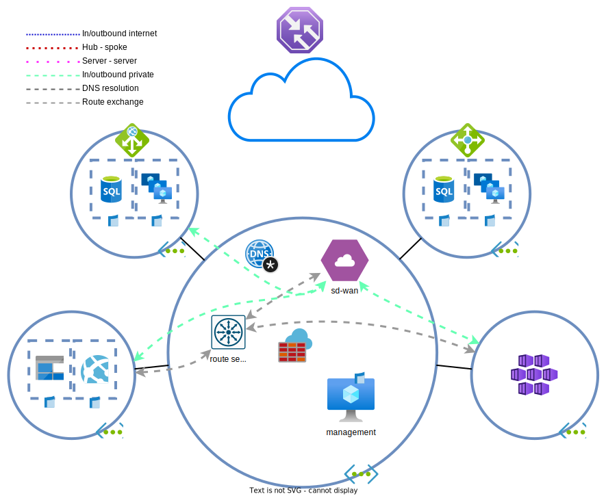

# Day 5 - Route server and Bastion

* [Route server](#route-server)
* [Azure bastion](#azure-bastion)
* [Lab clean-up](#lab-clean-up)

BY Health Insurances is growing rapidly. After the Netherlands and Ireland, offices are being opened in the United Kingdom and Germany. These branche offices will also be connected via the SD-WAN.

| locatie | subnetten | 
| --- | --- | 
| Nederland | 10.192.0.0/22 |
| Ierland | 10.192.4.0/22 |
| Verenigd Koninkrijk | 10.193.128.0/22 |
| Duitsland | 10.193.132.0/22 |

The network engineers are getting annoyed at repeatedly having to edit the route tables to accomodate new sites. As the SD-WAN appliance supports BGP, Azure [`route server`](https://learn.microsoft.com/en-us/azure/route-server/overview) can be used to automatically inject routes into a VNET. Before starting, make yourself familiar with the [limitations](https://learn.microsoft.com/en-us/azure/route-server/overview#route-server-limits) of this service.



## Route server

### Route server deployment

> **NOTE:** The placement of a `route server` is important. It will determine how routes are propagated and which peering functionality can be used. For peerings, `route servers` and `VPN gateways` are treated similarly and have the same limitations. It isn't possible to peer networks and have `route servers` in both networks and have the VNETs use each others `route servers`. 
>
> Its also not possible to have a combination of `route servers` en `virtual network gateway` be usable between peered VNETs.

> **NOTE:** `Route servers` transform a VNET into a `virtual hub` lite. This means that a `route server` cannot be repeatedly destroyed/created. `Virtual hub` deletions require that you wait an hour after removing an item before they are truly deleted. If you make a mistake creating the `route server` (e.g. wrong name), it's best to keep it as is and continue with the exercises. 

1. For this lab's purpose, it's best to deploy the `route server` in the hub. If needed, check the guide in the Azure [documentation](https://learn.microsoft.com/en-us/azure/route-server/quickstart-configure-route-server-portal). Pay attention to the following settings:
    * The subnet is required to have a specific name
    * Public IP
    * Branch-to-branch: Disabled

    > **NOTE:** The `route server` is not externally reachable and is not what routes traffic within the VNET. The resource is a BGP route server which distributes routes between systems without changing the next hop. The `public IP` is used for communication of the route server to the Azure platform.

1. Configure the peering on the `route server`. De SD-WAN appliance (not the internal `load balancer` fronting it) can be used as BGP peer.
    * Use `65002` as ASN

> **NOTE:** Now is a good time time deploy a `VPN gateway` in case you want to continue with exercise 6 after finishing this exercise. Before deploying the gateway, create an 'AzureBastionSubnet' in the hub for the `bastion` deployed later in this exercise. The reason for this is that it isn't possible to perform VNET updates as a `virtual network gateway` is being deployed. 
>
> After these steps, deploy the `VGW` as described in [exercise 6](../ex6/README_EN.md#deploying-the-vpn-gateway).

### SD-WAN BGP neighbors

> **NOTE:** As the exam isn't focused on configuring BGP, the lab won't focus it as well. However, it does help to have an understanding of BGP.

The SD-WAN appliance must be peered to the `route servers` to exchange routes. Migrating from `route tables` and `load balancers` to dynamic routing can cause downtime if the steps are performed incorrectly. Given how [Azure selects routes](https://learn.microsoft.com/en-us/azure/virtual-network/virtual-networks-udr-overview#how-azure-selects-a-route), what would be the best way to migrate the SD-WAN with the least amount of interruptions and downtimes?

> <details><summary>Downtime</summary>
>
> Configure the BGP peerings first. This introduces new (more specific, multiple /24s) routes that take precedence over the `route tables`. Existing flows continue without interruption. After a while, remove the route tables and subsequently the load balancer. This way the most amount of connections are drained from the load balancer which causes fewer interruptions when its removed.

</details>

Log in to the SD-WAN appliance (from the management server) and type `sudo vtysh` into the terminal. This places you in [Free Range Routing](https://frrouting.org/)'s CLI. It's a Cisco Like Interface.

The `route server` has two IP addresses (see the `Overview` tab) that have to be used as BGP peers. Each individual NVA peer must set up [Widentical peerings](https://learn.microsoft.com/en-us/azure/route-server/troubleshoot-route-server#the-bgp-peering-between-my-nva-and-azure-route-server-is-up-i-can-see-routes-exchanged-correctly-between-them-why-arent-the-nva-routes-in-the-effective-routing-table-of-my-vm) to each of the route server IPs.

Paste the below command block into the FRR CLI (after changing the `route server` IP addresses and the SD-WAN NVA's default gateway:

```cisco
configure terminal
ip route <rs_peer_1>/32 <default_gw_sd_wan_apparaat>
ip route <rs_peer_2>/32 <default_gw_sd_wan_apparaat>
router bgp 65002
neighbor <rs_peer_1> peer-group ROUTESRV
neighbor <rs_peer_2> peer-group ROUTESRV
end
write memory
```

Check if the peerings are established:

```cisco
show bgp summary
show bgp neighbors
```

And if routes are being exchanged:

```cisco
show bgp ipv4 neighbors <rs_peer> advertised-routes
show bgp ipv4 neighbors <rs_peer> received-routes
```

The [learned routes](https://learn.microsoft.com/en-us/azure/route-server/quickstart-configure-route-server-powershell#troubleshooting) can also be viewed on the `route server`. This cannot be done from the portal. The Azure API, PowerShell or Azure CLI can provide this information. An easy way to retrieve the date is to the the [`Cloud shell`](https://learn.microsoft.com/en-us/azure/cloud-shell/overview) and use the below PowerShell commands. The output can take up to a minute to return.

```powershell
$remotepeer = @{
    RouteServerName = 'myRouteServer'
    ResourceGroupName = 'myRouteServerRG'
    PeerName = 'myNVA'
}
Get-AzRouteServerPeerAdvertisedRoute @remotepeer
# and
Get-AzRouteServerPeerLearnedRoute @remotepeer
```

1. Check the route tables of some of the subnets in the hub. Ignore the spokes for now.

### Route table/load balancer removal

Perform the below steps to clean up the route tables and `load balancer` after the routes are exchanged:

1. Remove the SD-WAN routes from the `route tables` 
1. Remove the internal `load balancer`
1. Check if the IP addresses behind the SD-WAN can be pinged from the management server.
1. Check if the SD-WAN branch IP addresses can be pinged from the spoke API servers. Also check the effective routes of the servers. Why are the pings succeeding/failing? Does the intranet page work behind the SD-WAN?

    > <details><summary>VNET peerings and cross-peering resource usage</summary>
    >
    > VNET peerings have a lot of settings that can be configured. One of the options is to allow peered networks to access another network's `route server`/`VPN gateway`. If this setting is disabled, the spokes won't learn the BGP routes from the hub. BGP/VPN routes won't be exchanged as well if the hub doesn't allow the spoke to access the gateway/route server.
    >
    > In this case the spokes don't know the routes, but it still has a default route towards the `Azure firewall`. If the firewall allows the traffic, stateless traffic may succeed. The `AZF` will receive the ping and forward it to its default gateway. This gateway knows the BGP routes and forwards it to the SD-WAN appliance. As the SD-WAN appliance is in the hub, it knows the spoke address spaces and can return traffic directly. TCP traffic will fail in this scenario due to asymmetric routing, but ICMP will succeed.

    </details>

1. Edit the VNET peers to have the API server `NICs` learn the SD-WAN routes.
   > <details><summary>How to</summary>
   >
   > Edit the peerings for the hub and spoke `VNETs`. Make sure that the hub allows access to the `route server`/`virtual network gateway` and that the spokes are allowed to access the remote `route servers`/`virtual network gateways`.

   </details>
    * Verify the learned routes with the `Network Watcher` or the [`effective routes`](https://learn.microsoft.com/en-us/azure/virtual-network/diagnose-network-routing-problem#diagnose-using-azure-portal) functionality of the `NICs`.


## Azure bastion

BY's security department is uncomfortable with RDP over the internet. After some deliberation the new guidlines state that management traffic from remote workers must always happen over an [`Azure bastion`](https://learn.microsoft.com/en-us/azure/bastion/bastion-overview) connection.

### Azure bastion deployment

The company only requires RDP for Windows and SSH for Linux devices. The Basic SKU is sufficient for these requirements. The Standard SKU has a lot more capabilities such as (but not limited to): SSH tunneling, file copy and auto scaling. 

[Deploy the `bastion`](https://learn.microsoft.com/en-us/azure/bastion/quickstart-host-portal#createvmset) in the hub.

Try to [connect to the VMs](https://learn.microsoft.com/en-us/azure/bastion/quickstart-host-portal#connect):
* management server
* spoke VMs
* SD-WAN appliance

### Connectivity repair

Quite a lot of the `bastion` connections are blocked. In the old situation, management traffic was only allowed from the management server. The following resources may need to be edited to allow the `bastion` **SUBNET** to access the virtual machines:
1. management server NSG
1. spoke A NSG
1. spoke B NSG
1. possibly also the SD-WAN NSG

### External management access removal

Clean up unneeded rules now that `bastion` allows for management access.:
1. NSG and AZF ACEs and NAT rules  that allow RDP from the internet to the management server.
1. Ensure that the management server is still able to manage the environment.
1. Ensure that the management server isn't accessible from the internet.

## Lab clean-up

If you're not continuing to the next exercises, it's easier and cheaper to delete the lab when done. The end state of this lab can be [redeployed](../README_EN.md#lab-checkpoints) via the included [Terraform files](./tf/)
