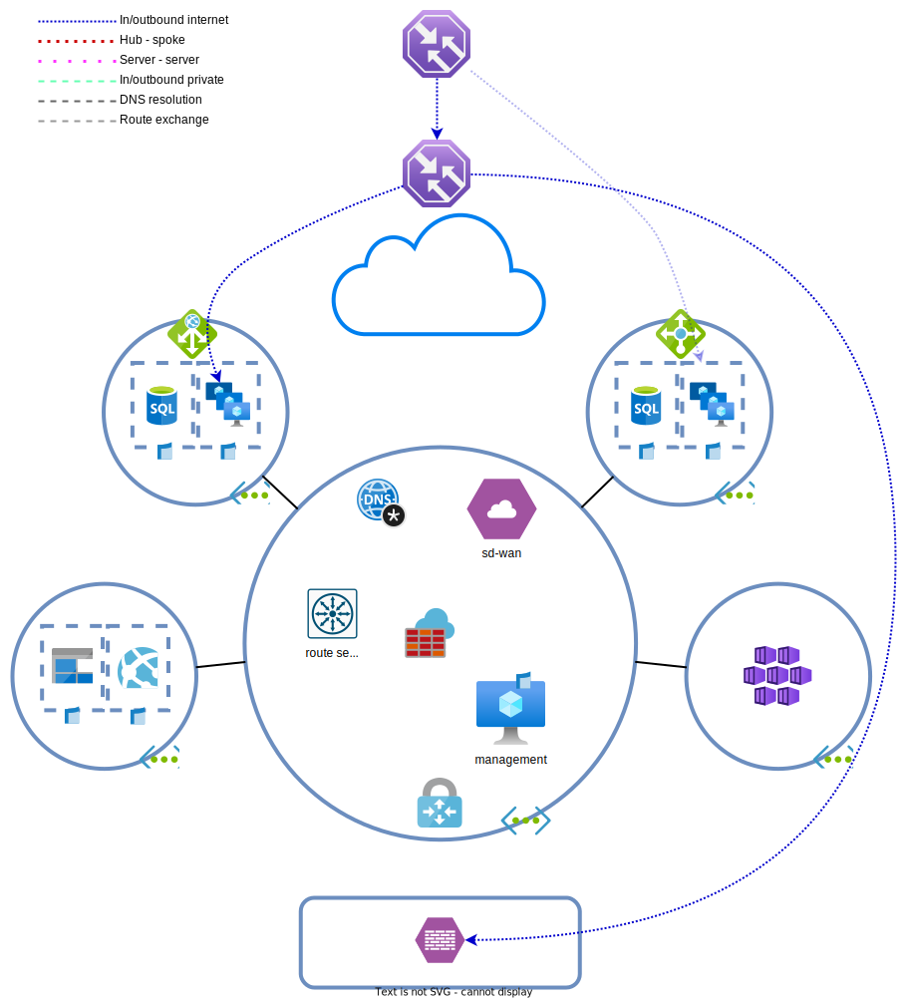

# Dag 6 - VPN Gateway

* [VPN Gateway](#vpn-gateway)
* [On-prem firewall uitrollen](#on-prem-firewall-uitrollen)
* [VPN configureren in Azure](#vpn-configureren-in-azure)
* [(Optioneel) Client VPN](#optioneel-client-vpn)
* [(Optioneel) Traffic manager aanpassingen](#optioneel-traffic-manager-aanpassingen)
* [Overig](#overig)
* [Opruimen lab](#opruimen-lab)

Na flink wat groei wil BY Verzekeringen wat workloads naar on-prem gaan verhuizen. Een deel van de IT omgeving heeft een steady state bereikt. De flexibiliteit van de cloud weegt niet op tegen de kosten van deze vaste lasten. Azure wordt niet uitgefaseerd. Het is puur een kostenbesparende maatregel. Dev omgevingen en extra capaciteit worden nog steeds in de cloud ingekocht.

BY bevindt zich in een plek met uitstekende internet verbindingen en wil hierom geen [`ExpressRoute`](https://docs.microsoft.com/en-us/azure/expressroute/expressroute-introduction) gebruiken. VPNs over het internet is voldoende. Er is ervoor gekozen om de SD-WAN appliance niet te gebruiken voor verbindingen tussen de datacentra en Azure, omdat deze geen client VPNs ondersteunt en het erop lijkt dat developers dit nodig gaan hebben in de toekomst.

De makkelijkste oplossing is dus een [`VPN Gateway`](https://docs.microsoft.com/en-us/azure/vpn-gateway/) (`VGW`).


## VPN Gateway

### VPN Gateway uitrollen

> **NOTE:** De plaatsing van een VPN gateway is van belang. Bij peerings, geldt dat een Virtual Network Gateway en een route server precies hetzelfde behandeld worden. Het is niet mogelijk om in twee gepeerde VNETs, elk een VPN gateway neer te zetten en de twee VNETs gebruik te laten maken van elkaars VGWs.
>
> Het is ook niet mogelijk om dit te doen met een combinatie van Virtual Network Gateways en route servers.

On-prem wordt gebruik gemaakt van BGP voor dynamische routering en VXLAN. Netwerken kunnen 5 minuten bestaan en even later weer verdwijnen. Voor het uitwisselen van de routes tussen DC en Azure zal ook BGP worden gebruikt.

Het uitrollen van een `VPN gateway` duurt lang. Ga lekker lunchen of iets dergelijks.

1. De `VGW` kan worden uitgerold in de hub. De uitrol spreekt redelijk voor zich.
    * De subnet moet een specifieke naam hebben
    * Gateway type: VPN
    * VPN type: de versie die [BGP](https://docs.microsoft.com/en-us/azure/vpn-gateway/vpn-gateway-bgp-overview#can-i-use-bgp-with-azure-policy-vpn-gateways) ondersteunt
    * SKU: De [goedkoopste](https://azure.microsoft.com/en-gb/pricing/details/vpn-gateway/#pricing) **NON AZ** versie die [BGP](https://docs.microsoft.com/en-us/azure/vpn-gateway/vpn-gateway-bgp-overview#is-bgp-supported-on-all-azure-vpn-gateway-skus) ondersteunt
        * In productie wil je wel zone redundancy
    * Enable active-active mode: Enabled
    * Configure BGP: Enabled
        * ASN: 65515
        * Custom Azure APIPA BGP IP address: 
            * Geen, we gebruiken de standaard tunnel adressen die Azure genereert voor de Active/Active virtual network gateway
            * Het is mogelijk APIPA adressen te gebruiken in plaats van routed adressen. In productie kan dat tijd en moeite schelen indien het vrijspelen van IP adressen moeilijk is.

    > <details><summary>Route server en virtual network gateways</summary>
    >
    > Wanneer een route server en network gateway worden gebruikt in combinatie met BGP, moet de network gateway in active/active modus draaien.
    >
    > De ASN van de `VNGs` mogen gelijk zijn aan die van de `route server`. Afhankelijk van de configuratie is de peering tussen de `VNGs` en `route servers` dus EBGP of IBGP. Dit kan routing beinvloeden.
    </details>

## On-prem firewall uitrollen

Het volgende stuk is puur om in Azure een simulatie te maken van een datacenter netwerk die al bestaat. Voor het doel van deze labs, is het een black box. Wat jij als engineer weet is dat er een site to site verbinding moet komen tussen de netwerken in Azure die jij beheert, en de datacentra die door een ander team beheerd wordt.

### Uitrollen VNET voor on-prem firewall

1. Rol een `VNET` uit in Azure. De address space maakt niet uit. De Linux firewall die we uit gaan rollen simuleert wat subnets.
1. Maak een subnet aan voor de Linux firewall
1. Maak een `NSG` aan:
    * IKE/IPSec in en outbound
    * SSH vanuit jouw eigen publieke IP. 
    * HTTP om de API ook vanuit het datacenrum beschikbaar te maken.
1. BGP hoeft niet, dit gebeurt binnen in de tunnel.

### Uitrollen on-prem firewall

Wacht totdat de `VGW` uitgerold is en haal zijn publieke IP-adres op.

1. Rol nu een Ubuntu 22.04 VM uit als firewall.
    * Gebruik zinnige sizes en instellingen
    * Geef de VM een public IP
    * Gebruik de gegevens uit de [cloud-init](./tf/data/cloud-init.vpn.yml.j2) file in **CUSTOM DATA**, niet **USER DATA**.
      
      > **NOTE:** pas de `${vgw_peer_1}`, `${vgw_bgp_peer_1}`, `${vgw_peer_2}` en `${vgw_bgp_peer_2}` variabelen aan naar de `VGW` public IPs (vgw_peer) en de `(Secondary) Default Azure BGP peer IP addresses` (vgw_bgp_peer_1) onder `Configuration` bij de `virtual network gateway`.

Er is nu een 'datacentrum' die als remote netwerk gebruikt kan worden. Test voor de zekerheid of je op de 'firewall' in kan loggen.

## VPN configureren in Azure

Een VPN verbinding in Azure bestaat uit drie delen:
1. `VPN gateway`, het apparaat dat de verbinding op zet
2. `Local network gateway`, informatie over het remote apparaat (vanuit het perspectief van de `VPN gateway`) 
3. `Connection`, koppelt een `VPN gateway` aan een `local network gateway` en specificeert de instellingen.

### Local network gateway

De on-prem firewall moet worden gedefinieerd als een `LNG`. Maak deze aan.
* Endpoint: Beide opties zijn mogelijk, kies hier wat fijner is
* Address Spaces: Houd deze leeg. We gebruiken BGP, dus hoeven we geen 'statische routes' toe te voegen.
    * Indien je geen BGP gebruikt, zul je hier de netwerken moeten invullen die achter de VPN te benaderen zijn.
* Onder tab advanced BGP enablen

Van het DC NOC zijn de volgende BGP gegevens ontvangen
* ASN: 65003
* BGP peer address: 10.64.255.255

Welke gegevens moeten worden doorgegeven aan het NOC?

> <details><summary>VPN gateway BGP config</summary>
>
> Deze gegevens zijn makkelijk te vinden bij de `Virtual Network Gateway` onder 'Configuration'.
</details>

### Connection

Met het DC NOC zijn de volgende instellingen afgesproken:
* PSK: `DitIsEENV4ilugP0sSwerd`
* Phase 1:
    * Encryption: GCMAES128
    * Integrity: SHA256
    * DH Group: DH20 (ECP384)
* Phase 2:
    * Encryption: GCMAES128
    * Integrity: GCMAES128
    * DH Group: DH20 (ECP384)
* IPsec SA lifetime KB: 102400000
* IPsec SA lifetime s: 3600

Maak een `connection` aan en gebruik de bovenstaande instellingen. Configureer in de connection ook de volgende items:
* Connection type: Site-to-site (IPsec)
* Enable BGP: aanvinken

### Troubleshooten VPN verbinding

De VPN verbinding wil niet actief worden. Dit zie je onder de `connection` bij `Overview`. Gebruik de `VPN troubleshoot` item om de VPN te troubleshooten. Stuur de output naar de log/`network watcher` `storage account`. Dit kan 5 minuten duren.

Wacht totdat je een status terug krijgt onder kolom `Troubleshooting status`. Selecteer de `connection` en niet de gateway en controleer onder `Details` het `Action` tabblad.

> <details><summary>Oorzaak en oplossing</summary>
> 
>
> Het lijkt erop dat de PSK verkeerd is. Na wat aandringen geeft het NOC aan dat ze het laatste karakter niet mee hadden gekopieerd. De correcte PSK is `DitIsEENV4ilugP0sSwerd!`.
> 
> Voer deze in in de `connection`.
>
> De zip file die wordt weggeschreven naar de `storage account` bevat de logs van de gateway indien je die zou willen bekijken. Meer troubleshooting informatie kan je in de [Microsoft documentatie](https://learn.microsoft.com/en-us/azure/vpn-gateway/reset-gateway?WT.mc_id=Portal-Microsoft_Azure_HybridNetworking) vinden.

</details>

Controleer of de verbinding actief wordt. Dit kan op de `connection` resource, maar ook op de 'firewall':
```bash
sudo swanctl --list-conns
```

```
azure_primary: IKEv2, no reauthentication, rekeying every 14400s, dpd delay 30s
  local:  10.10.0.4
  remote: 20.8.124.18
  local pre-shared key authentication:
  remote pre-shared key authentication:
  route_vpn_primary: TUNNEL, rekeying every 3600s or 1024000000 bytes, dpd action is clear
    local:  0.0.0.0/0
    remote: 0.0.0.0/0
azure_secondary: IKEv2, no reauthentication, rekeying every 14400s, dpd delay 30s
  local:  10.10.0.4
  remote: 20.8.124.107
  local pre-shared key authentication:
  remote pre-shared key authentication:
  route_vpn_secondary: TUNNEL, rekeying every 3600s or 1024000000 bytes, dpd action is clear
    local:  0.0.0.0/0
    remote: 0.0.0.0/0
```

### Controleren BGP sessies en routes

Als het goed is worden de BGP sessies nu actief en worden routes uitgewisseld. Op de 'on-prem firewall' kun je met `sudo vtysh` de FRR daemon beheren

```cisco
show bgp summary
show ip route
```

Ook kun je onder de `virtual network gateway` > `BGP peers` de peerings en geleerde routes zien. 
Als laatst kun je naar de `effective routes` kijken van de spoke VMs

Wat valt je op als je naar de output van de 'firewall', gateway en `effective routes` kijkt?

> <details><summary>Route servers en gateways</summary>
> `Route servers` wisselen niet automatisch routes uit met `virtual network gateways`, ook niet `ExpressRoute gateways`. Indien dit gewenst is, moet onder de `route server` > `Configuration`, `Branch-to-branch` aan worden gezet.
>
> Nadat dit gedaan is, zal je alle routes zien op de SD-WAN, gateway en on-prem firewall.

</details>

## (Optioneel) Client VPN

> **NOTE:** Indien je geen toegang tot een Azure AD tenant hebt waar je global admin bent (of gebruikers applicaties in Azure AD mogen registereren), is deze opdracht theoretisch.

BY developers die thuis werken moeten via een client VPN kunnen verbinden met de development omgeving. BY wil graag dat de VPN TCP/443 gebruikt en authenticatie direct tegen Azure AD doet. Ook moet het kunnen werken op Windows, MacOS en Linux distributies.

Welke [client/point-to-site VPN](https://learn.microsoft.com/en-us/azure/vpn-gateway/point-to-site-about#protocol) type voldoet aan deze eisen?

### Configureren client VPN

1. Ga naar de `VPN gateway` en open de `Point-to-site configuration`. Configureer hier de client VPN als volgt:
    * Address pool: 10.96.0.0/24
    * Tunnel type: OpenVPN (SSL)
    * Authentication type: Azure Active Directory
    * Public IP address: Doordat we active/active draaien, is een load balanced client VPN IP-adres nodig. Maak een nieuwe of gebruik een beschikbare bestaande. Gebruik niet die van de NAT gateway.
2. Configureer de Azure Active Directory instellingen. Let op dat je de tenant identifier gebruikt en niet de tenant domein naam:
    * Tenant: [https://login.microsoftonline.com/{tenantId}/](https://learn.microsoft.com/en-us/azure/vpn-gateway/openvpn-azure-ad-tenant#configure-point-to-site-settings)
    * Audience: [41b23e61-6c1e-4545-b367-cd054e0ed4b4](https://learn.microsoft.com/en-us/azure/vpn-gateway/openvpn-azure-ad-tenant#configure-point-to-site-settings)
    * Issuer: [https://sts.windows.net/{tenantId}/](https://learn.microsoft.com/en-us/azure/vpn-gateway/openvpn-azure-ad-tenant#configure-point-to-site-settings)
3. Met een Azure AD admin account kan je toegang geven tot AAD authenticatie. Klik hiervoor op `Grant administrator consent for Azure VPN client application` of doe dit zoals in de [handleiding](https://learn.microsoft.com/en-us/azure/vpn-gateway/openvpn-azure-ad-tenant#enable-authentication) beschreven.
    * Vink consent on behalf of your organization aan. Hiermeer zorg je ervoor dat gebruikers deze prompt niet krijgen.
    
4. Klik op 'Save'. De deployment duurt 10+ minuten. Download de VPN client configuratie bovenaan de pagina nadat de wijzigingen doorgevoerd zijn. Pak de ZIP bestanden uit.

### Inloggen op de client VPN

Installeer de 'Azure VPN Client' conform de [handleiding](https://learn.microsoft.com/en-us/azure/vpn-gateway/openvpn-azure-ad-client). Na het installeren kun je de azurevpnconfig.xml importeren.

Verbind met de VPN. Welke routes krijg je allemaal mee?

## (Optioneel) Traffic manager aanpassingen

BY zou graag willen dat 50% van alle API requests naar het datacentrum gaat. De rest moet naar Azure in West Europa. Pas als beide zones niet werken, moet het naar de standby regio in North Europe.



Dit is in te regelen door traffic manager hierachisch in te richten.
* Een global profile met [priority](https://learn.microsoft.com/en-us/azure/traffic-manager/traffic-manager-routing-methods) balancing.
    * Profile 1 gaat naar een [nested profile](https://learn.microsoft.com/en-us/azure/traffic-manager/traffic-manager-nested-profiles) en heeft een priority van 100
        * Nested profile is [weighted](https://learn.microsoft.com/en-us/azure/traffic-manager/traffic-manager-routing-methods) en heeft een gelijke verdeling tussen on-prem en West Europe. On-prem moet als een external endpoint geconfigureerd worden, omdat het 'buiten Azure' draait.
    * Profile 2 gaat naar de Azure firewall (die naar de externe North Europe LB NAT) met een priority van 120

Bezoek de parent `traffic manager` en controleer of je alleen de juiste API locaties ziet.

Controleer ook met DNS:
```linux
dig @1.1.1.1 <fqdn> +short
```

```windows
Resolve-DnsName <fqdn> -Server 1.1.1.1
```

## Overig

Wat je hier bouwt is vergelijkbaar met een Virtual WAN en Virtual Hub routing. Het verschil is dat deze oplossingen een deel van het handwerk wegnemen. Je hoeft met minder rekening te houden, maar je bent ook minder flexibel.

Filtering van BGP routes in Azure kan niet (met uitzondering van Virtual WAN). Voor site-to-site verbindingen moet dit puur op basis van routes. Wanneer de verbinding een `ExpressRoute` betreft, kan ook gebruik worden gemaakt van (VNET) [BGP communities](https://learn.microsoft.com/en-us/azure/expressroute/how-to-configure-custom-bgp-communities-portal). 

Het is moeilijk om met ExpressRoutes aan de slag te gaan. Ook hier geldt weer dat goed inlezen/videos kijken voldoende moet zijn.

## Opruimen lab

Het is het gemakkelijkst en goedkoopst om het lab z.s.m. op te ruimen wanneer het niet meer nodig is en [opnieuw uit te rollen](../README.md#lab-checkpoints) via de bijgevoegde [Terraform bestanden](./tf/).
