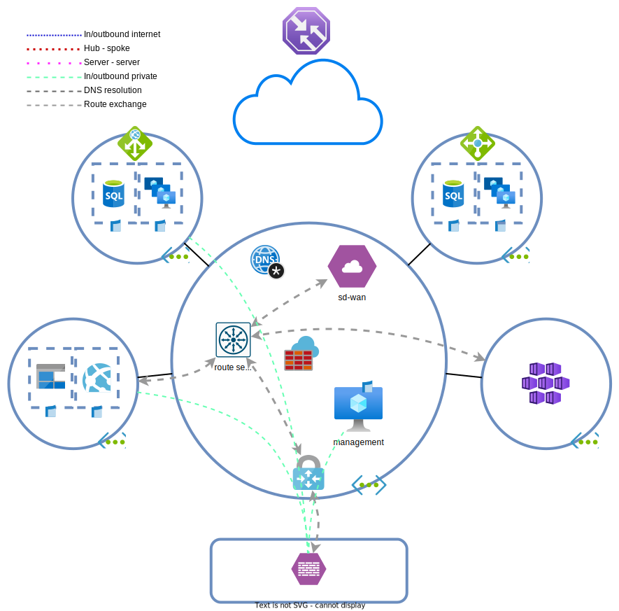

# Dag 6 - VPN Gateway

* [VPN Gateway](#vpn-gateway)
* [On-prem firewall uitrollen](#on-prem-firewall-uitrollen)
* [VPN configureren in Azure](#vpn-configureren-in-azure)
* [(Optioneel) Client VPN](#optioneel-client-vpn)
* [(Optioneel) Traffic manager aanpassingen](#optioneel-traffic-manager-aanpassingen)
* [Overig](#overig)
* [Lab clean-up](#lab-clean-up)

As BY Health Insurances is growing fast, cloud costs are starting to rise. The company has a high constant load and the variance in load isn't a lot. This means that the flexibility of the cloud is outweighed by the costs being incurred by the steady state. For this reason, part of the workload will be migrated to an on-premises datacenter. This is not a full migration back to on-premises, but their hybrid cloud strategy. Part of the production workload, dev/test environments and scale out will still be performed in Azure.

BY's datacenters and offices are located in places with excellent internet connectivity. For this reason BY has chosen to forgo an [`ExpressRoute`](https://learn.microsoft.com/en-us/azure/expressroute/expressroute-introduction) in favor of a VPN solution for connectivity between Azure and on-prem. Sadly, the SD-WAN device cannot be used to terminate the site-to-site VPN on. BY wants to support client VPNs for developers and the SD-WAN appliance doesn't support client VPNs.

The easiest solution is to use a [`VPN Gateway`](https://learn.microsoft.com/en-us/azure/vpn-gateway/) (`VGW`).

## VPN Gateway

### Deploying the VPN Gateway

> **NOTE:** The placement of a `VPN gateways` is important. It will determine how routes are propagated and which peering functionality can be used. For peerings, `route servers` and `VPN gateways` are treated similarly and have the same limitations. It isn't possible to peer networks and have `VPN gateways` in both networks and have the VNETs use each others `VPN gateways`. 
>
> Its also not possible to have a combination of `route servers` en `virtual network gateway` be usable between peered VNETs.

On-prem, BGP is used for dynamic routing and VXLAN. Networks can exists one moment and disappear minutes later. For this reason routes need to be updated dynamically between Azure and the datacenter. BGP will be used for this purpose.

If the `VPN gateway` isn't deployed yet, start the deployment and take a break as the gateway deployment [takes a long time](https://learn.microsoft.com/en-us/azure/vpn-gateway/vpn-gateway-about-vpngateways#vpn).

1. The `VGW` can be deployed in the hub. The deployment is straightforward.
    * The subnet must have a specific name.
    * Gateway type: VPN
    * VPN type: the version that supports [BGP](https://learn.microsoft.com/en-us/azure/vpn-gateway/vpn-gateway-bgp-overview#can-i-use-bgp-with-azure-policy-vpn-gateways).
    * SKU: the [cheapest](https://azure.microsoft.com/en-gb/pricing/details/vpn-gateway/#pricing) **NON AZ** version that supports [BGP](https://learn.microsoft.com/en-us/azure/vpn-gateway/vpn-gateway-bgp-overview#is-bgp-supported-on-all-azure-vpn-gateway-skus).
        * You may want to have zone redundancy in a real production environment
    * Enable active-active mode: Enabled
    * Configure BGP: Enabled
        * ASN: 65515
        * Custom Azure APIPA BGP IP address:
            * None, we'll be using the default tunnel addresses generated by Azure for the active/active virtual network gateway.
            * It's possible to use APIPA addresses instead of routed address. This may save time and effort if finding available prefixes is a difficult task.

    > 

Route servers and virtual network gateways

    >
    > When a route server and network gateway are used in combination with BGP, the network gateway has to be deployed in active/active mode. I do not know the reason for this. Maybe it has to do with Azure requiring redundancy. 
    >
    > The ASN of the `VNGs` is allowed to be the same as the `route server's`. Depending on the configuration, the peering between the `VNGs` and `route servers` can be EBGP or IBGP. This can influence routing.

    

## On-prem firewall deployment

The following segment is purely to build an 'on-prem' datacenter in Azure. For the purposes of the labs, the on-prem environment is a black box. What you have to do as engineer is configure a site-to-site VPN connection between the Azure networks and the datacenter managed by the NOC.

### On-prem VNET deployment

1. Deploy a `VNET` in Azure. The used address-space doesn't matter. The to be deployed Linux firewall will simulate some subnets.
1. Create a subnet for the Linux firewall
1. Create an `NSG`:
    * Allow IKE/IPSec in- and outbound.
    * Allow SSH from your own public IP. 
    * Allow HTTP for the API service from everywhere.
    * BGP doesn't need to be allowed in the NSG. BGP traffic traverses over the tunnel.

### On-prem firewall deployment

Wait until the `VGW` is deployed en retrieve the public IP addresses.

1. Deploy an Ubuntu 22.04 VM as the firewall.
    * Use sensible sizes and settings
    * Assign the VM a public IP
    * Enter the contents of the [cloud-init](./tf/data/cloud-init.vpn.yml.j2) file in **CUSTOM DATA**, not **USER DATA**.
      
      > **NOTE:** change the `${vgw_peer_1}` and `${vgw_peer_2}` variabeles to the `VGW` public IPs.
      > 
      > Change the `${vgw_bgp_peer_1}` and `${vgw_bgp_peer_2}` variabeles to the `(Secondary) Default Azure BGP peer IP addresses` under the `virtual network gateway` > `Configuration` section.

We've just built a 'datacenter' and 'firewall' to be used as remote network. Try to log in to the 'firewall' to make sure you have connectivity.

>
> Het is ook niet mogelijk om dit te doen met een combinatie van Virtual Network Gateways en route servers.

## Lab clean-up

If you're not continuing to the next exercises, it's easier and cheaper to delete the lab when done. The end state of this lab can be [redeployed](../README_EN.md#lab-checkpoints) via the included [Terraform files](./tf/)
