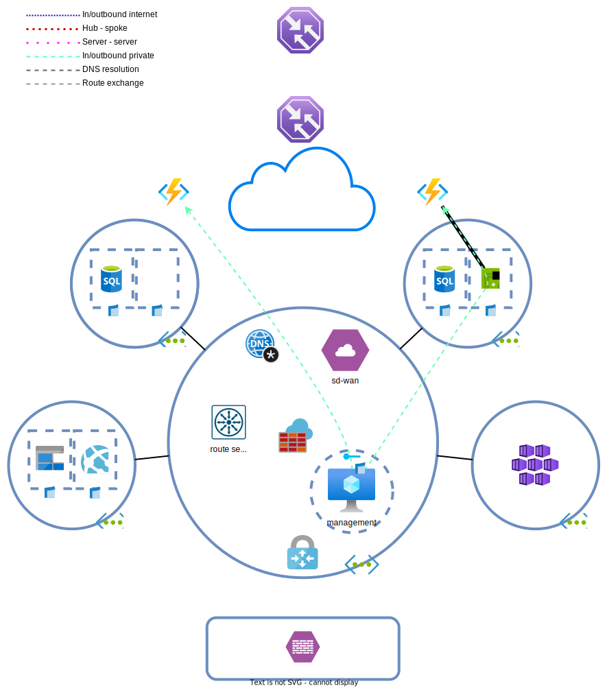

# Dag 7 - Private/service endpoints en VNET integration

* [Azure Functions](#azure-functions)
* [Service endpoint](#service-endpoint)
* [Private endpoint](#private-endpoint)
* [VNET integration](#vnet-integration)
* [(Optioneel) Traffic manager aanpassingen](#optioneel-traffic-manager-aanpassingen)
* [Opruimen lab](#opruimen-lab)

De rekeningen vanuit Azure zijn niet mals. BY beseft dat alles in VMs draaien niet kosten efficient is. Ze willen `Azure Functions` (PaaS API webservers) gaan gebruiken voor hun API. Ook vindt security dat outbound internet verkeer standaard geblokkeerd moet worden. Met de PII waar de verzekeraar mee te maken heeft, moet alles zo dicht mogelijk staan en zo min mogelijk verkeer over het internet gaan.

Om aan deze eisen te voldoen zal gebruik worden gemaakt van Function Apps om de web servers te vervangen en service endpoints en private endpoints om aan de security eisen te voldoen.



## Azure Functions

De migratie mag met downtime plaats vinden. Er hoeft geen langzame, ononderbroken migratie plaats te van de webservers naar de `function apps`.

Hoe zou de migratie met minimale downtime uitgevoerd kunnen worden?

> <details><summary>Migratie opties</summary>
>
> Er zijn veel opties. Het is op te lossen met DNS record aanpassingen, de `AGW` verkeer laten load balancen en door `traffic manager` en `Azure front door`. `NVAs` zijn ook nog een mogelijkheid.

</details>

### Verwijderen uitgefaseerde diensten

Verwijder de volgende resources:
* spoke A webserver en toebehoren
* spoke B webserver en toebehoren
* application gateway en toebehoren
* external load balancer en toebehoren
* Verwijder de VM en AGW subnetten
* behoud de NSGs en UDRs

### Aanpassen firewall

Blokkeer alle outbound verkeer op de AZF, maar sta east-west verkeer toe. Zorg ervoor dat [`kms.core.windows.net`](https://learn.microsoft.com/en-us/troubleshoot/azure/virtual-machines/custom-routes-enable-kms-activation#solution) en [`azkms.core.windows.net`](https://learn.microsoft.com/en-us/troubleshoot/azure/virtual-machines/custom-routes-enable-kms-activation#solution) nog steeds bereikbaar zijn op `http/tcp:1688`. Zonder de KMS regel, kunnen Windows VMs zich niet activeren.

### Azure functions uitrollen

> **NOTE:** Function apps zijn geen onderdeel van het examen. Het gaat in de opdracht om de service endpoints. `Function apps` hebben altijd een [`App Service Plan`](https://learn.microsoft.com/en-us/azure/app-service/overview-hosting-plans) en een storage account nodig. Een ASP is een server waar de function op draait. Elke `ASP` kan meerdere functions bevatten.

Rol twee [`function apps`](https://learn.microsoft.com/en-us/azure/azure-functions/functions-create-function-app-portal) uit, een in West Europe en een in North Europe.
* Basics
    * Publish: Code
    * Runtime stack: Python
    * Version: 3.9
    * Plan type: App service plan
    * SKU and size: Dev/Test > B1
* Monitoring
    * Enable Application Insights: No

Nadat de `functions` succesvol uitgerold zijn, gaan we de API deployen. Ga naar de `function app` > Deployment Center > Tabblad Settings.
1. Selecteer als source 'External Git'
2. Bij repository moet 'https://github.com/draggeta/AzureLabFunction.git' ingevuld worden
3. Bij Branch moet 'master' ingevuld worden
4. Klik op save
5. (Optioneel) Controleer bij tabblad Logs de deployment. Dit kan even duren. Bij status 'Success (Active)' is het gelukt.
6. Probeer de API op `https://<fqdn>/api/info` en `https://<fqdn>/api/health` (dit keer zonder '/' aan het eind)
7. Probeer ook de API vanuit de management server. Dit zou niet moeten lukken.

> **NOTE:** De onderstaande opdrachten zijn puur lab opdrachten om de mogelijkheden en beperkingen van de diensten te leren kennen. 
>
> De spoke A function app zal voor de management server via service endpoints bereikbaar worden gemaakt. De B function app via private endpoints. Ook zal er getest worden met VNET integration.

## Service endpoint

Het is niet mogelijk om vanuit de management server de APIs te benaderen. Het is wel gewenst, maar Security wil niet dat de management server het internet op kan. 
[`Service endpoints`](https://learn.microsoft.com/en-us/azure/virtual-network/virtual-network-service-endpoints-overview) hebben niet meer de voorkeur, maar ze kunnen prima gebruikt worden. `Service endpoints` voegen een directe route over de Microsoft backbone toe richting bepaalde PaaS diensten. Het verkeer gaat niet over het internet en apparaten die gebruik hiervan maken hoeven geen internet verbinding te hebben. In de meeste gevallen omzeilt dit verkeer ook een NVA.

Een nadeel is dat alleen apparaten die in een subnet met een `service endpoint` zitten, gebruik kunnen maken van deze `service endpoints`. Andere subnetten en vanuit on-prem kunnen niet een willekeurige `service endpoint` gebruiken.

Service endpoints zijn voor een beperkte set resources beschikbaar.

### Service endpoint configureren

Ga naar het hub netwerk en open het subnet waar de management server zich in bevindt. Selecteer de 'Microsoft.Web' service onder de `Service Endpoints` en pas de wijzigingen toe. 
* Controleer de toegang tot de spoke A en B APIs vanuit de management server. 
* Bekijk de effective routes van de management server NIC.

> <details><summary>Service endpoints beveiligen</summary>
>
> Wanneer een `service endpoint` aan een subnet wordt gekoppeld, kan elk apparaat in dat subnet bij elke resource van het type. Dit is een probleem. Het is van belang dat door middel van `NSGs` en [`service tags`](https://learn.microsoft.com/en-us/azure/virtual-network/service-tags-overview) outbound verkeer wordt gelimiteerd.
>
> Voor `storage accounts` kan ook gebruik worden gemaakt van [`service endpoint policies`](https://learn.microsoft.com/en-us/azure/virtual-network/virtual-network-service-endpoint-policies-overview).

</details>

De management server kan nu bij alle app services/function apps. Limiteer voor de management server de toegang tot alleen function apps in 'West Europe' (spoke A) en blokkeer alle overige function apps. Dit kan door gebruik te maken van de juiste `service tags` en de bestaande `NSG`. 

> <details><summary>Hint</summary>
>
> Je hebt hier meer dan één outbound rule voor nodig.

</details>

Waarom kan dit niet op de `Azure firewall` geblokkeerd worden?
Hoe loopt het verkeer vanuit de on-prem firewall richting de function app?

## Private endpoint

Het is nog steeds niet mogelijk om vanuit de management server de API in Spoke B te benaderen. De door Microsoft aangerade oplossing om diensten intern te ontsluiten is om [`private endpoints`](https://learn.microsoft.com/en-us/azure/private-link/private-endpoint-overview) te gebruiken. Voor het lab wordt de 'West Europe' `function app` met een `private endpoint` gekoppeld aan de spoke B `VNET`.

### Uitrollen private endpoint

Private endpoints kunnen uitgerold worden in subnets met andere resources. Zorg ervoor dat in spoke B een subnet aanwezig is waar de private endpoint in terecht kan komen. Maak ook een NSG aan (indien die niet al bestaat) die alleen inbound HTTP toestaat vanuit de management server. Koppel deze aan de subnet. Koppel ook de spoke UDR aan het subnet.

Ga naar de spoke B `function app` > Networking > `Private endpoints` en voeg een endpoint toe
* Integrate with private DNS zone: No
    * Dit gaan we handmatig doen

Wacht totdat de endpoint uitgerold is. Probeer vanaf de management server `https://<fqdn>` te bereiken of een van de API calls uit te voeren. Resolve ook de FQDN met:

```powershell
Resolve-DnsName <fqdn>
```

Wat gaat er mis? Lukt het wel op de private endpoint IP?

> <details><summary>Private endpoints en DNS</summary>
>
> Je krijgt vooralsnog het externe IP-adres terug, waar je niet bij mag. De `private endpoint` heeft wel een interne IP, maar niks resolvet er nog naar. Om het werkende te krijgen, moet een [privatelink.* DNS zone](https://learn.microsoft.com/en-us/azure/private-link/private-endpoint-dns#azure-services-dns-zone-configuration) worden aangemaakt specifiek voor de resource type en gekoppeld worden aan de VNET waar DNS resolvet wordt. Ook moet de `private endpoint` zijn DNS in deze zone registreren.
>
> Er gebeurt hierna iets 'magisch'. Resource met een private link krijgen automatisch een privatelink CNAME. 
> ```
> storageaccount.core.windows.net > storageaccount.privatelink.core.windows.net
> ```
> > Extern is de resolving als volgt: `<storageaccount>.core.windows.net` > dit is een CNAME voor `<storageaccount>.privatelink.core.windows.net` > uiteindelijk door publieke DNS resolving een A record voor externe IP storage account.
>
> Intern is de DNS resolving als volgt: `<storageaccount>.core.windows.net` > dit is een CNAME voor `<storageaccount>.privatelink.core.windows.net` > uiteindelijk door de private DNS zone resolved naar interne IP storage account.
>
> Resources zonder private endpoint hebben geen privatelink CNAME en zullen hierdoor altijd extern benaderd worden.

</details>

### Private DNS repareren.

We gaan de interne DNS zo inrichten dat vanuit intern er altijd een interne IP-adres terug gegeven wordt.
1. Maak een `private DNS zone` aan met de [juiste naam](https://learn.microsoft.com/en-us/azure/private-link/private-endpoint-dns#azure-services-dns-zone-configuration). 
    * `Function apps` gebruiken dezelfde naam als `app services`. 
1. Koppel de zone aan de hub VNET.
    * Auto registration kan uit.
1. Ga naar de `private endpoint` > DNS configuration en klik op 'Add configuration'.
    * Selecteer de juiste Private DNS zone
    * Zone group mag op default blijven staan
    * Bedenk een zinnige configuration name
    * Klik op add

Test nadat de uitrol gelukt is de onderstaande punten:
* de DNS resolving
* bereikbaarheid van de spoke B API vanuit de management server
* bereikbaarheid van de spoke B API vanuit de SD-WAN appliance
    * Wat gaat hier mis?

> <details><summary>Private endpoints en NSGs</summary>
>
> `Private endpoints` [negeren standaard](https://learn.microsoft.com/en-us/azure/private-link/disable-private-endpoint-network-policy?tabs=network-policy-portal) `NSGs` en `UDRs`. UDRs worden alleen gebruikt voor return traffic. NSGs worden alleen gebruikt voor inbound verkeer. De link geeft aan hoe dit kan indien je dit niet zelf uit wilt zoeken.

</details>

Schakel de ondersteuning voor network policies in op de subnet.

Test ook of de website vanuit extern te benaderen is.

> <details><summary>Private endpoints en app services/function apps</summary>
>
> `App services` en `function apps` zijn [niet meer extern te benaderen](https://learn.microsoft.com/en-us/azure/private-link/private-endpoint-overview#network-security-of-private-endpoints) wanneer een `private endpoint` gekoppeld wordt. Dit zijn de enige type resources waar dit het geval is. 
>
> De API server moet echter wel vanuit het internet te benaderen zijn. Dit is op te lossen onder de `function app` > Networking > Access Restrictions (preview). Hier kan toegang vanuit het internet toegestaan worden.

</details>

Repareer de externe toegang tot de spoke B API. Iedereen moet erbij kunnen.

## VNET integration

De `function apps` in Azure zijn nu benaderbaar vanuit de VNET. De apps kunnen echter niet bij interne bronnen. Private en service endpoints faciliteren alleen verkeer richting de dienst, niet omgekeerd. Voor outbound verkeer vanuit de app services richting de VNET, kan gebruik worden gemaakt van [`VNET integration`](https://learn.microsoft.com/en-us/azure/app-service/overview-vnet-integration) (VI). De dienst zorgt ervoor dat een app service/function app een subnet toegewezen krijgt waar vandaan het verkeer kan sturen.

De[ grootte van het subnet](https://learn.microsoft.com/en-us/azure/app-service/overview-vnet-integration#subnet-requirements) bepaalt in welke mate de function app horizontaal kan schalen. Ook kan het subnet niks anders bevatten dan de VNET integration. Verder kan elk IP in de subnet als source dienen voor verkeer dat van de function app af komt.


> **NOTE:** Voor het lab gaan we VNET integration uitrollen voor alleen de spoke A function. Dit is puur om tijd te besparen.
> De integration rolt snel uit, maar het kan 1-2 minuten duren voordat de instance herstart wordt en de in de **VNET geconfigureerde DNS** gebruikt.

### Uitrollen VNET integration

> **NOTE:** De function app heeft een endpoint (`/api/getweb`) die websites op kan halen. Het is een slechte, onveilige proxy.

Configureer nu de VNET integration:
1. Maak een subnet in spoke A aan voor VNET integration.
1. Ga naar de `function app` > Networking > VNET integration en voeg een nieuwe VI toe.
    * Let op de VNET en gebruikte subnet
    * Controleer dat `Route All` uit staat na het configureren van de VNET Integration
1. Bezoek de volgende pagina's via een browser (vanuit waar maakt niet uit)
    * `https://<func a endpoint>/api/getweb?url=https://dilbert.com`
    * `https://<func a endpoint>/api/getweb?url=http://sdwan01.by.cloud`
    * `https://<func a endpoint>/api/getweb?url=http://10.32.1.1` # 'on-prem' datacenter
    * `https://<func a endpoint>/api/getweb?url=https://<func b endpoint>/api/info`

Welke websites werken en welke niet? Waarom?

> <details><summary>VNET Integration en routing</summary>
>
> [VI routing is best ingewikkeld](https://learn.microsoft.com/en-us/azure/app-service/overview-vnet-integration#routes). Kort gezegd komt het neer op het volgende:
> 1. Route All uit, routeert alleen RFC1918 netwerken het netwerk in. Dit verkeer is onderheving aan NSGs/UDRs
> 1. Route All aan, kan alle verkeer het netwerk in routeren. Welk verkeer het netwerk in wordt gerouteert is afhankelijk van de gekoppelde UDR. Alle verkeer dat intern gerouteerd wordt is ook onderheving aan NSGs.
> 
> De spoke B API is niet bereikbaar omdat het subnet geen route heeft voor dit netwerk. De route voor de SD-WAN en on-prem DC worden wel automatisch geleerd. Het verkeer richting Dilbert gaat direct het internet op.

</details>

1. Koppel de spoke A UDR aan de VI subnet.
1. Bezoek de volgende pagina's via een browser (vanuit waar maakt niet uit)
    * `https://<func a endpoint>/api/getweb?url=https://dilbert.com`
    * `https://<func a endpoint>/api/getweb?url=http://sdwan01.by.cloud`
    * `https://<func a endpoint>/api/getweb?url=http://10.32.1.1` # 'on-prem' datacenter
    * `https://<func a endpoint>/api/getweb?url=https://<func b endpoint>/api/info`

Alle webpagina's, inclusief de spoke B API zijn nu bereikbaar. Waarom?

1. Configureer de VNET integration: zet `Route All` aan.
1. Bezoek de volgende pagina's via een browser (vanuit waar maakt niet uit)
    * `https://<func a endpoint>/api/getweb?url=https://dilbert.com`
    * `https://<func a endpoint>/api/getweb?url=http://sdwan01.by.cloud`
    * `https://<func a endpoint>/api/getweb?url=http://10.32.1.1` # 'on-prem' datacenter
    * `https://<func a endpoint>/api/getweb?url=https://<func b endpoint>/api/info`

Nu werkt Dilbert niet. Waarom niet?

## (Optioneel) Traffic manager aanpassingen

Repareer `traffic manager`. Verkeer mag nu gelijk over West Europe en North Europe worden verdeeld (Weighted). Door de verschillen tussen de function apps en on-prem, kan on-prem weggelaten worden uit de TM policies.

> **NOTE:** De health checks zullen lukken, maar de API is niet bereikbaar via de TM FQDN. De reden hiervoor is dat function apps alleen verkeer accepteren waarvan de FQDN geregistereerd is bij de function app. 
> Om dit werkende te krijgen, moet je een eigen DNS zone hebben en de gewenste FQDN configureren op de `function app` en instellen als CNAME voor de traffic manager FQDN.

## Opruimen lab

Het is het gemakkelijkst en goedkoopst om het lab z.s.m. op te ruimen wanneer het niet meer nodig is en [opnieuw uit te rollen](../README.md#lab-checkpoints) via de bijgevoegde [Terraform bestanden](./tf/).
