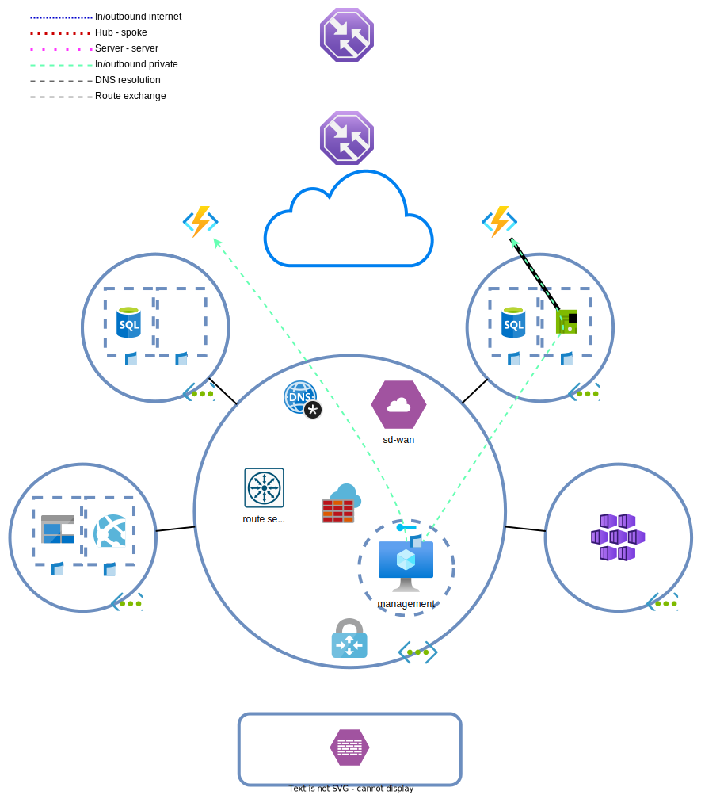

# Day 7 - Private/service endpoints and VNET integration

* [Azure Functions](#azure-functions)
* [Service endpoint](#service-endpoint)
* [Private endpoint](#private-endpoint)
* [VNET integration](#vnet-integration)
* [(Optioneel) Traffic manager aanpassingen](#optioneel-traffic-manager-aanpassingen)
* [Lab clean-up](#lab-clean-up)

VMs are convenient, as they allow consistent deployment models between Azure and on-prem, but are not cost efficient. By wants to move to `Azure functions` (PaaS API webservers) for their API services.

Security has also introduced another request. Due to the massive amount of PII being handled by the insurer, all outbound north-south traffic must be blocked for management services unless needed.

To meet the requirements, `function apps` will replace the API servers and service endpoints and private endpoints will be used to limit north-south traffic.



## Azure Functions

The migration windows allows for downtime of the service. There is no need for a slow migration with no service interruption.

How could the migration be performed with a minimal amount of downtime?

> <details><summary>Migration options</summary>
>
> There are many options. Downtime can be limited with DNS record changes or by using `AGW`, `traffic manager` or `Azure front door` as load balancers. `NVAs` are of course also a possibile solution.

</details>

### Remove deprecated/decommisioned services

Remove the following resources and related resources:
* spoke A webserver (and `disk`, `NIC`)
* spoke B webserver (and `disk`, `NIC`)
* `application gateway` (and `public IP`, `subnet`)
* `external load balancer` (and `public IP`)
* VM and `AGW` subnets
* keep the `NSGs` and `route tables`

### Update firewall configuration

Block all outbound internet traffic on the `AZF`. **DO NOT** block any other east-west traffic. Make sure that [`kms.core.windows.net`](https://learn.microsoft.com/en-us/troubleshoot/azure/virtual-machines/custom-routes-enable-kms-activation#solution) and [`azkms.core.windows.net`](https://learn.microsoft.com/en-us/troubleshoot/azure/virtual-machines/custom-routes-enable-kms-activation#solution) are still available on `http/tcp:1688`. Without these rules, Windows VMs won't be able to activate.

### Deploy Azure functions

> **NOTE:** `Function apps` are not a part of the exam. In the following exercises its all about the (service/private) endpoints. `Function apps` run on (and as such require) an  [`App Service Plan`](https://learn.microsoft.com/en-us/azure/app-service/overview-hosting-plans) and a `storage account`. An `ASP` is just an Azure managed VM that can (multiple) functions.

Deploy two [`function apps`](https://learn.microsoft.com/en-us/azure/azure-functions/functions-create-function-app-portal), one in West Europe and one in North Europe.
* Basics
    * Publish: Code
    * Runtime stack: Python
    * Version: 3.9
    * Plan type: App service plan
    * SKU and size: Dev/Test > B1
* Monitoring
    * Enable Application Insights: No

After succesful deployment of the `functions`, the next step is to deploy the API. Go to `function app` > Deployment Center > Tabblad Settings.
1. Select 'External Git' as source
1. Enter 'https://github.com/draggeta/AzureLabFunction.git' as the repository
1. Enter 'master' as branch
1. Save the deployment
1. (Optional) Verify the deployment status under the tab 'Logs'. When the status becomes 'Success (Active)' the deployment is done. This can take a while.
1. Try to access the API on `https://<fqdn>/api/info` and `https://<fqdn>/api/health` (without a trailing '/')
1. Try to access the API from the management server. This should not succeed.

> **NOTE:** The following exercises are purely lab exercises to learn the possibilities and limits of the services.
>
> The spoke A `function app` will be made available to the management server via `service endpoints`. The B `function app` will be accessible via private endpoints. We'll also be testing with VNET integration to learn about PaaS outbound connectivity.

## Service endpoint

It's now not possible to access the APIs from the management server. This is something the developers do want. However, as mentioned before, the security department doesn't want the management server to access the internet.
[`Service endpoints`](https://learn.microsoft.com/en-us/azure/virtual-network/virtual-network-service-endpoints-overview) are not the preffered solution, but they can still be used without issues. `Service endpoints` add direct routes over the Microsoft backbone to the enabled PaaS services. The traffic does not go out to the internet and the devices using the service endpoint don't need an internet connection. In most cases, service endpoint traffic will bypass `NVAs`.

A disadvantage of `service endpoint` is that only the devices in subnets with `service endpoints` can access these services. Other subnets (and on-prem networks) cannot access services via a configured `service endpoint`. 

`Service endpoints` are only available for a limited set of resoruces.

### Configure service endpoint 

Go to the hub network and open the management server subnet. Select the 'Microsoft.Web' service under `Service Endpoints` and apply the changes. 
* Verify the access to the spoke A and B APIs from the management server. 
* Check the effective routes of the management server NIC.

> <details><summary>Secure service endpoints</summary>
>
> When a `service endpoint` is attached to a subnet, every device in that subnet's able to access resources of the `service endpoint` type. This may be an issue. Outbound traffic  to `service endpoints` can be limited by using `NSGs` and [`service tags`](https://learn.microsoft.com/en-us/azure/virtual-network/service-tags-overview).
>
> `Storage accounts` `service endpoints` can also use [`service endpoint policies`](https://learn.microsoft.com/en-us/azure/virtual-network/virtual-network-service-endpoint-policies-overview) to limit traffic only to specific storage accounts.

</details>

The managament server is able to access all `app services`/`function apps`. Limit the management server's access to only function apps in 'West Europe' (spoke A) and block all other function apps. This can be done by using the existing management `NSG` and `service tags`.

> <details><summary>Hint</summary>
>
> This action requires more than one outbound rule.

</details>

Why can this traffic not be blocked on the `Azure firewall`?
How does the on-prem traffic flow to the `function app`?

## Private endpoint

It's (still) not possible to access the API server in spoke B from the management server. [`Private endpoints`](https://learn.microsoft.com/en-us/azure/private-link/private-endpoint-overview) are the Microsoft recommended solution for internal connectivity. For this lab, we'll be attaching the 'North Europe' `function app` with a `private endpoint` to the spoke B `VNET`.

### Deploying private endpoints

`Private endpoints` can be deployed in subnets together with other resources. Make sure that `VNET` B has a subnet available for the `private endpoint`. Create an `NSG` (if it doesn't already exist) that only allows inbound HTTP(S) from the management server. Attach the `NSG` to the subnet. Also attach the `spoke` B route table to the subnet to make sure return traffic is able to find its way back.

Go to the spoke B `function app` > Networking > `Private endpoints` and add an endpoint.
* Integrate with private DNS zone: No
    * We'll be doing this manually

Wait until the endpoint is finished deploying. From the management server visit `https://<fqdn>` to view the default `function app` webpage. Also try to perform an API call to one of the endpoints. Resolve the FQDN as well:

```powershell
Resolve-DnsName <fqdn>
```

Why isn't it succeeding? Does it succeed on the `private endpoint` IP?

> <details><summary>Private endpoints and DNS</summary>
>
> The DNS query returns an external IP address, which the management server isn't allowed to access. The `private endpoint` does have an internal IP, but no DNS record is pointing to it. Accessing the `function app`/`app service` on its internal IP won't work either, as they require [SNI](https://en.wikipedia.org/wiki/Server_Name_Indication). To get it working, a [privatelink.* DNS zone](https://learn.microsoft.com/en-us/azure/private-link/private-endpoint-dns#azure-services-dns-zone-configuration) must be created for the specific resource type and attached to the VNET where DNS resolution happens. The `private endpoint` must register itself into this `private DNS zone`.
>
> All resources with a private link get a privatelink CNAME. This is always the case and the FQDN always resolves to the privatelink CNAME.
> ```
> functionapp.azurewebsites.net > functionapp.privatelink.azurewebsites.net
> ```
> Externally, the DNS resolution happens as follows: `<functionapp>.azurewebsites.net` > this is a CNAME for `<functionapp>.privatelink.azurewebsites.net` > eventually resolved by public DNS to the external IP of the `function app`.
>
> Internally, the DNS resolution happens as follows: `<functionapp>.azurewebsites.net` > this is a CNAME for `<functionapp>.privatelink.azurewebsites.net` > resolved by the `private DNS zone` to the interne IP of the `function app`.
>
> Resources without a privatelink CNAME are always reached via the internet.

</details>

### Private DNS repareren.

We're going to set up the internal DNS so that it always returns an internal IP address if a `private link` exists for the `function apps`/`app services`. The function app needs to register itself into the internal DNS.
1. Create a `private DNS zone` with the [correct name](https://learn.microsoft.com/en-us/azure/private-link/private-endpoint-dns#azure-services-dns-zone-configuration) for the type.
    * `Function apps` use the same type/name as `app services`. 
1. Attach the zone to the hub `VNET`
    * Auto registration can be disabled.
1. Go to the `function app` `private endpoint` > DNS configuration and click on 'Add configuration'.
    * Select the correct `Private DNS zone`
    * Zone group can remain 'default'. This is mostly handy for automation, to help view groups of records.
    * Name the registration sensibly
    * Click on add.

Test the following points after the successful deployment:
* DNS resolving
* reachability of the spoke B API from the management server
* reachability of the spoke B API from the SD-WAN appliance
    * Why is the SD-WAN appliance able to access the private endpoint?


> <details><summary>Private endpoints and NSGs</summary>
>
> `Private endpoints` [by default ignore](https://learn.microsoft.com/en-us/azure/private-link/disable-private-endpoint-network-policy?tabs=network-policy-portal) `NSGs` and `RTs`. It's possible to have the endpoints respect the policies and routes. The link describes how to enable this setting. 
>
> Route tables are only used for return traffic. NSGs are only used for inbound traffic.

</details>

Turn the support for network policies on for the `subnet` containing the `private endpoint`.

Test if the website is available from outside the `VNET`.

> <details><summary>Private endpoints and app services/function apps</summary>
>
> `App services` and `function apps` [stop being available externally](https://learn.microsoft.com/en-us/azure/private-link/private-endpoint-overview#network-security-of-private-endpoints) when a `private endpoint` is attached. These are the only resource types where this is the case.
>
> It is a requirement that the API server is reachable from the internet. This requirement can be met by going to the `function app` > Networking > Access Restrictions (preview) item. From here, access from the internet can be allowed.

</details>

Fix the external access to the spoke B API server. It is a public service.

## VNET integration

The `function apps` are now reachable from inside the `VNETs`/`subnets`. The apps however, cannot access internal resources. Private and service endpoints only facilitate traffic inbound towards the endpoint. For outbound traffic from the app towards resources in the a `VNET`, [`VNET integration`](https://learn.microsoft.com/en-us/azure/app-service/overview-vnet-integration) is the recommended option. The `VI` service claims a subnet for itself. 

The [size of the subnet](https://learn.microsoft.com/en-us/azure/app-service/overview-vnet-integration#subnet-requirements) determines the capacity for the app to scale out (horizontally). The `VNET` also cannot contain anything other than the `VNET integration`. All traffic originating from the service is sourced from a random IP in the subnet and as such the whole subnet range needs to be used in ACLs.


> **NOTE:** To save time, we'll be deploying the `VNET integration` only for the spoke A function.
> The integration deployment takes little time, but it can take up to two minutes before the function is restarted and begins using the **VNET configured DNS**.

### Deploying the VNET integration

> **NOTE:** The function app has an endpoint (`/api/getweb`) that is able to fetch websites. It is a crappy, self written proxy to test the `VNET integration` functionality.

> **NOTE:** restart the function app after each change. This propagates the changes faster.

Configure the `VNET integration`:
1. Create a subnet in spoke A for the `VNET integration`.
1. Go to the `function app` > Networking > VNET integration and add a new integration.
    * Select the correct VNET and subnet.
    * Make sure that `Route All` is disabled after configuring the VNET integration.
1. Visit the following websites from a browser (the location doesn't matter).
    * `https://<func a endpoint>/api/getweb?url=https://dilbert.com`
    * `https://<func a endpoint>/api/getweb?url=http://sdwan01.by.cloud`
    * `https://<func a endpoint>/api/getweb?url=http://10.32.1.1` # 'on-prem' datacenter
    * `https://<func a endpoint>/api/getweb?url=https://<func b endpoint>/api/info`

Which websites work and which don't? Why?

> <details><summary>VNET Integration and routing</summary>
>
> [VI routing is quite complicated](https://learn.microsoft.com/en-us/azure/app-service/overview-vnet-integration#routes). Long story short:
> 1. Route All off, routes only RFC1918 addresses into the netwerk. This traffic is affected by `NSGs`/`route tables`
> 1. Route All on, has the capability to route all traffic into the network. Which traffic is routed into the network is dependent on the attached `route table`. All internally routed traffic is also affected by `NSGs`.
> 
> The spoke B API isn't reachable because the VI subnet has no route to this network. The routes for the SD-WAN and on-prem DC are automatically learned. Traffic to Dilbert is directly sent to the internet.

</details>

1. Attach the spoke A `route table` to the VI subnet.
1. Visit the following websites from a browser (the location doesn't matter).
    * `https://<func a endpoint>/api/getweb?url=https://dilbert.com`
    * `https://<func a endpoint>/api/getweb?url=http://sdwan01.by.cloud`
    * `https://<func a endpoint>/api/getweb?url=http://10.32.1.1` # 'on-prem' datacenter
    * `https://<func a endpoint>/api/getweb?url=https://<func b endpoint>/api/info`

All pages, including the spoke B API are now reachable. Why?

1. Configure the `VNET integration`: turn `Route All` on.
1. Visit the following websites from a browser (the location doesn't matter).
    * `https://<func a endpoint>/api/getweb?url=https://dilbert.com`
    * `https://<func a endpoint>/api/getweb?url=http://sdwan01.by.cloud`
    * `https://<func a endpoint>/api/getweb?url=http://10.32.1.1` # 'on-prem' datacenter
    * `https://<func a endpoint>/api/getweb?url=https://<func b endpoint>/api/info`

Dilbert has stopped working. Why?

## (Optional) Traffic manager changes

Fix `traffic manager`. Traffic should be equally split between West Europe and North Europe. Due to the changes between the function apps and on-prem, it's better to leave the on-prem environment out of the `TM` policies.

> **NOTE:** The health checks will succeed, but the API won't be reachable via the TM FQDN. The reason for this is that function apps check the SNI to know which instance to access.
> To get this working, you'd need your own DNS zone and configure the desired FQDN on the `function app` and set it up as a CNAME for the traffic manager FQDN.

## Lab clean-up

If you're not continuing to the next exercises, it's easier and cheaper to delete the lab when done. The end state of this lab can be [redeployed](../README_EN.md#lab-checkpoints) via the included [Terraform files](./tf/)
