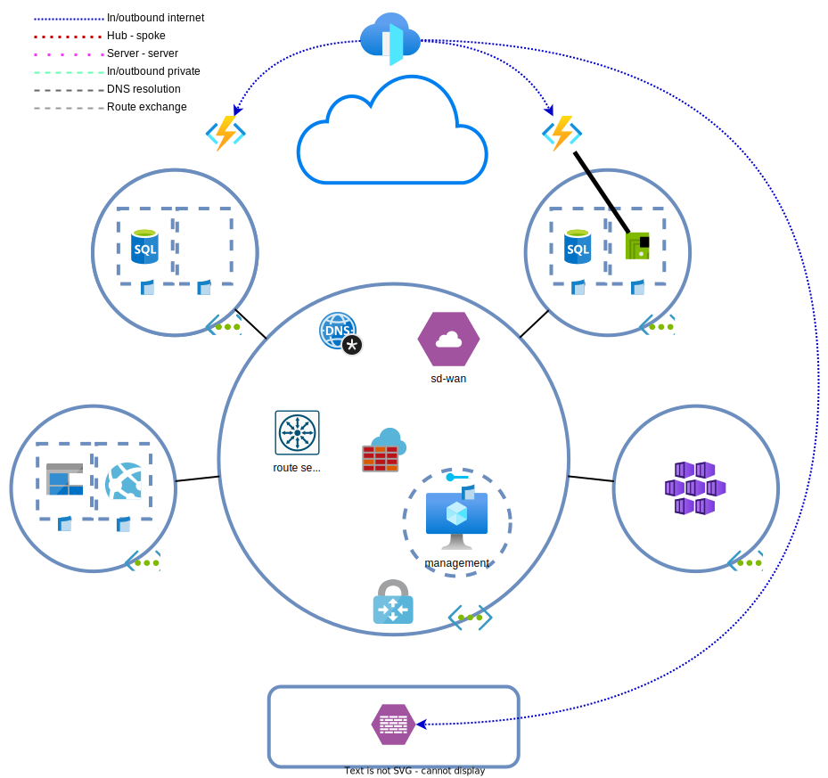

# Dag 8 - Azure Front Door en overige
* [Azure Functions](#azure-functions)
* [Service endpoint](#service-endpoint)
* [Private endpoint](#private-endpoint)
* [VNET integration](#vnet-integration)
* [(Optioneel) Traffic manager aanpassingen](#optioneel-traffic-manager-aanpassingen)
* [Opruimen lab](#opruimen-lab)

De nieuwe regelgeving van De Hollandsche Bank eist dat financiele instellingen al hun externe diensten via IPv6 aan moeten gaan bieden.

Ook merkt BY verzekeringen op dat gebruikers buiten Nederland en Ierland een slechtere ervaring hebben bij het gebruik maken van hun diensten. Het grootste probleem zit het in het ophalen van statische resources. Zeker de instructievideos willen nog wel eens bufferen. Dit zorg voor een verlaagde retentie op de site doordat consumenten afhaken. 

Om deze redenen wil BY data dichter bij gebruikers cachen. Dit kan met een CDN, maar de architecten vinden het gebruik van Azure Front Door een beter idee, omdat ze dan ook meteen aan de DHB eisen voldoen. Ook hoeven er minder losse resources beheerd te worden in Azure.

## Verwijderen Traffic Manager profiles

Verwijder de Traffic Manager profiles. Deze zullen we na de implementatie van Azure Front Door niet meer nodig hebben. Zeker aangezien het [niet werkt met de function apps door de FQDN](../ex7/README.md#optioneel-traffic-manager-aanpassingen) problemen.

In productie is het prima mogelijk om Azure Front Door voor TM profiles te plaatsen.

## Azure Front Door

Doordat de function apps en on-prem server compleet andere endpoints hebben, is het voor het lab niet echt mogelijk om verkeer goed over alle drie de endpoints te load balancen. Voor de front door oefening splitsen we de twee typen endpoints (function app en on-prem webservers).

Het uitrollen van Azure Front Door kan naast de huidige bestaande omgeving. Zoek in de Azure portal naar `Front Door and CDN profiles`. Kies hier voor Front Door en custom settings. Configureer de settings als volgt:
* Secrets: voer hier niks in. Dit is handig als je je eigen domein gaat gebruiken waar eigen certs bij horen. Deze hebben we niet.
* Endpoint: 
    * Kies een naam voor de FQDN van de front door
    * Voeg een route toe voor de function apps
        * Patterns to match: '/*' dit is de catch-all
        * Voeg een origin group toe met beide function apps als origin (gebruik app service als type. Verdeel het verkeer 50/50).
        * Health probe interval: 10 secondes
        * Accepted Protocols: HTTP en HTTPS
        * Redirect: Aanvinken
        * Schakel caching in.
            > 

Query string behavior

            >
            > De gekozen query string caching behavior maakt niet uit voor het lab, maar in productie is het van belang om te [weten wat ze doen](https://learn.microsoft.com/en-us/azure/frontdoor/front-door-caching?pivots=front-door-standard-premium#query-string-behavior).

            

    * Voeg een route toe voor de on-prem omgeving
        * Patterns to match: `/on-prem` en `/on-prem/*`
        * Voeg een origin group toe met de on-prem firewall/API service als **custom** destination en HTTP voor de backend
        * Health probe interval: 10 secondes
        * Accepted Protocols: HTTP en HTTPS
        * Redirect: Aanvinken
        * Origin path: `/`
            > 

Origin Path

            >
            > De origin path kan gebruikt worden voor URL rewrites. Zonder path, wordt het pad zoals het binnenkomt doorgegeven aan de backend server. Met path, wordt het deel in de pattern match vervangen door de origin path. Hieronder een stuk tekst uit de [documentatie](https://learn.microsoft.com/en-us/azure/frontdoor/standard-premium/how-to-configure-route#create-a-new-azure-front-door-standardpremium-route):
            >
            >	This path is used to rewrite the URL that Azure Front Door will use when constructing the request forwarded to the origin. By default, this path isn't provided. As such, Azure Front Door will use the incoming URL path in the request to the origin. You can also specify a wildcard path, which will copy any matching part of the incoming path to the request path to the origin. Origin path is case sensitive.
            >
            > Pattern to match: /foo/*  
            > Origin path: /fwd/  
            >
            > Incoming URL path: /foo/a/b/c/  
            > URL from Azure Front Door to origin: fwd/a/b/c.  
   
            

    * Security policy: Geen nodig

Het kan meer dan twee minuten duren voordat de front door configuratie doorgevoerd is. Dit is omdat de configuratie over alle edges en regions verspreid moet worden. Onder het kopje Front Door Manager kun je de provisioning state bekijken.

Bezoek nu de API services op:
* `https://<front door fqdn>/api/info`  # azure functions
* `https://<front door fqdn>/on-prem/`  # on-prem

Dit zou resultaat terug moeten geven. Probeer ook de FQDN te resolven, welke soort adressen krijg je terug?
* linux: `dig <front door fqdn> +short`
* windows: `Resolve-DnsName <front door fqdn>`

## Onbehandelde items

Er zijn wat items die in het examen mogelijk terug komen, maar niet behandeld zijn. De redenen ervoor zijn verschillend maar in de meeste gevallen komt het neer op kosten of het feit dat het niet mogelijk is om ze volledig uit te rollen in een test omgeving. Probeer deze items uit.

### (Optioneel) IPv6

Toevallig zorgt Front Door ervoor dat je diensten (publiekelijk) ook via IPv6 te benaderen zijn. Dat scheelt. Het werkt ook voor diensten die geen IPv6 ondersteunen zoals de Azure functions.

IPv6 is voor [VNETs en VMs](https://learn.microsoft.com/en-us/azure/virtual-network/ip-services/ipv6-overview) breed beschikbaar, maar aardig wat PaaS diensten [ondersteunen](https://learn.microsoft.com/en-us/azure/virtual-network/ip-services/ipv6-overview#limitations) het [nog niet](https://msandbu.org/ipv6-support-in-microsoft-azure/).

* Probeer IPv6 in de on-prem VNET uit te rollen.
* Koppel ook een publiek IPv6 adres aan de 'firewall'.
* Pas NSG regels aan, kunnen IPv4 en IPv6 regels gecombineerd worden?

### (Optioneel) Forceer verkeer door de Azure firewall

Verkeer tussen on-prem en de spokes gaat niet langs de Azure firewall. Dit is standaard het geval en is in bepaalde gevallen ongewenst. Door route tables aan te passen, kan verkeer tussen spokes en on-prem altijd door de firewall.

* Pas de UDRs aan
* Configureer een UDR op de VGW subnet
* Maak firewall regels aan die verkeer toe staan
* Gebruik de log analytics om de logs te bekijken

### (Optioneel) Global load balancer

De global load balancer is voor L4 wat Azure Front door is voor L7. Het is gebruikt een anycast public IP en kan verkeer load balancer naar externe publieke load balancers. Rol twee externe load balancers uit en zet daar een global load balancer voor.

* Kan het met een basic SKU?
* Welke regio's ondersteunen de GLB?
* Wat is het gevolg als de regio waar de GLB gehost wordt down gaat?

### (Optioneel) Security/WAF policies

Security policies kunnen gebruikt worden om verkeer te filteren op applicatie niveau. Deze policies kunnen op meerdere plekken gebruikt worden, waaronder de Front Door.

* Configureer op de Azure Front Door security policies die verkeer vanuit niet Europese landen blokkeert

### (Optioneel) ExpressRoute

Een volledige ExpressRoute configureren kan niet, maar we kunnen wel een eind komen. 

* Rol een ExpressRoute circuit uit.
* Rol een ExpressRoute gateway uit.
* Vind de service key voor de ExpressRoute circuit. Deze key moet normaal gesproken aan de provider zijde ingevoerd worden.
* De connection tussen de circuit en gateway kan niet gemaakt worden omdat de circuit niet actief kan worden.

### (Optioneel) Virtual WAN

Azure VWAN is een oplossing om vele locaties binnen een regio op een (wat makkelijkere) wijze aan elkaar te koppelen. Het uitrollen en verwijderen van deze oplossing kan redelijk wat tijd kosten.

* Rol een Virtual WAN uit en controleer de instellingen.
* Met welke providers integreert het?
* Maak van de Virtual WAN een secure hub.

## Opruimen lab

Het is het gemakkelijkst en goedkoopst om het lab z.s.m. op te ruimen wanneer het niet meer nodig is en [opnieuw uit te rollen](../README.md#lab-checkpoints) via de bijgevoegde [Terraform bestanden](./tf/).
