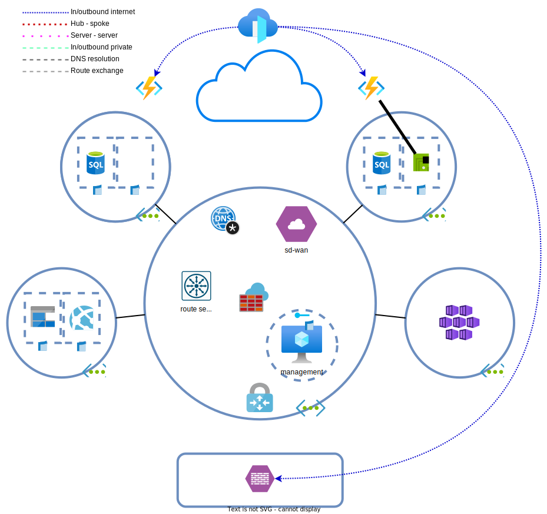

# Day 8 - Azure Front Door and others

* [Remove Traffic Manager profiles](#remove-traffic-manager-profiles)
* [Azure Front Door](#azure-front-door)
* [Uncovered items](#uncovered-items)
* [(Optioneel) IPv6](#optioneel-ipv6)
* [(Optioneel) Forceer verkeer door de Azure firewall](#optioneel-forceer-verkeer-door-de-azure-firewall)
* [(Optioneel) Global load balancer](#optioneel-global-load-balancer)
* [(Optioneel) Security/WAF policies](#optioneel-securitywaf-policies)
* [(Optioneel) ExpressRoute](#optioneel-expressroute)
* [(Optioneel) Virtual WAN](#optioneel-virtual-wan)
* [Lab clean-up](#lab-clean-up)

With the new regulations imposed by De Hollandsche Bank, BY has to start offering all external services via IPv6.

BY has also noticed that users outside of the Netherlands and Ireland have a significantly worse experience when using their services. The biggest problem is the added delay retrieving static resources from the services. Especially instructional videos tend to buffer a lot. These issues have an adverse effect on consumer retention.

BY wants a solution to cache data closer to users. A CDN can be used, but the architects have decided to use Azure `Front door`. `AFD` namely has the benefit of also exposing services via IPv6, which is another checkbox checked. Using `AFD` also makes it so that less separate services need to be managed.

## Remove Traffic Manager profiles

Remove the `Traffic Manager` profiles. These resources won't be needed after implementing Azure `front door`. Especially as the TM profiles are broken [due to the `function app`/FQDN](../ex7/README.md#optioneel-traffic-manager-aanpassingen) issues.

> **NOTE:** In production it's a valid architecture to use `AFD` and `TM` profiles side by side or `AFD` in front of `TM`.

## Azure Front Door

Due to the fact that the endpoints are completely different between the function apps and on-prem servers, it's not really possible to load balance traffic accross all three endpoints (spoke A, B and on-prem). For this reason, the exercise is split into two, one for the function apps and one for the on-prem webservers.

Front door can be deployed in an existing environment without issues. Search the Azure portal for `Front Door and CDN profiles`. Select `Front door` and `custom settings`. This allows us to view more configurations before deployment.
* Secrets: keep it empty. This is used for certs for custom domains.
* Endpoint:
    * Choose a name as the FQDN of the front door
    * Add a route for the function apps: (a path to match)
        * Patterns to match: `/*` (any path not matched by other rules is matched by this rule)
        * Add an origin group with both function apps as origin. (Use app service as type. Divide the traffic evenly over both origins)
        * Health probe interval: 10 seconds
        * Accepted Protocols: HTTP and HTTPS
        * Redirect: check
        * Enable caching.        

            > 

Query string behavior

            >
            > The chosen query string caching behaviour doesn't matter in the lab environment, but in production it's good to know what [each option does](https://learn.microsoft.com/en-us/azure/frontdoor/front-door-caching?pivots=front-door-standard-premium#query-string-behavior).

            

    * Add a route for the on-prem environment:
        * Patterns to match: `/on-prem` and `/on-prem/*`
        * Add an origin group with the on-prem firewall/API service as **custom** destination and use HTTP for the backend
        * Health probe interval: 10 secondes
        * Accepted Protocols: HTTP en HTTPS
        * Redirect: check
        * Origin path: `/`
            > 

Origin Path

            >
            > De origin path can be used for URL rewrites. Without the path, the path is passed as is to the backend server. With an origin path, everything in the pattern match is replaced by the origin path. Below is a quote from the [documentatie](https://learn.microsoft.com/en-us/azure/frontdoor/standard-premium/how-to-configure-route#create-a-new-azure-front-door-standardpremium-route):
            >
            >	*This path is used to rewrite the URL that Azure Front Door will use when constructing the request forwarded to the origin. By default, this path isn't provided. As such, Azure Front Door will use the incoming URL path in the request to the origin. You can also specify a wildcard path, which will copy any matching part of the incoming path to the request path to the origin. Origin path is case sensitive.*
            >
            > *Pattern to match: /foo/**  
            > *Origin path: /fwd/*  
            >
            > *Incoming URL path: /foo/a/b/c/*  
            > *URL from Azure Front Door to origin: fwd/a/b/c.**  
   
            

    * Security policy: keep it empty

It can take more than two minutes before the front door configuration is active. This is due to the fact that the configuration has to be deployed to all regions and edges. The provisioning state can be viewed under the 'Front Door Manager' section.

Perform requests to the API::
* `https://<front door fqdn>/api/info`  # azure functions
* `https://<front door fqdn>/on-prem/`  # on-prem

Also try to resolve the FQDNs. Both IPv4 and IPv6 addresses should be returned.
* linux: `dig <front door fqdn> +short`
* windows: `Resolve-DnsName <front door fqdn>`

## Uncovered items

This is the end of the lab. However, there are some items not covered by this lab but can come up in the exam. The reasons for the omissions are varied, but mostly come down to the fact that these are expensive resources or that the deployments of these resources aren't lab friendly.

### (Optioneel) IPv6

Toevallig zorgt Front Door ervoor dat je diensten (publiekelijk) ook via IPv6 te benaderen zijn. Dat scheelt. Het werkt ook voor diensten die geen IPv6 ondersteunen zoals de Azure functions.

IPv6 is voor [VNETs en VMs](https://learn.microsoft.com/en-us/azure/virtual-network/ip-services/ipv6-overview) breed beschikbaar, maar aardig wat PaaS diensten [ondersteunen](https://learn.microsoft.com/en-us/azure/virtual-network/ip-services/ipv6-overview#limitations) het [nog niet](https://msandbu.org/ipv6-support-in-microsoft-azure/).

* Probeer IPv6 in de on-prem VNET uit te rollen.
* Koppel ook een publiek IPv6 adres aan de 'firewall'.
* Pas NSG regels aan, kunnen IPv4 en IPv6 regels gecombineerd worden?

### (Optioneel) Forceer verkeer door de Azure firewall

Verkeer tussen on-prem en de spokes gaat niet langs de Azure firewall. Dit is standaard het geval en is in bepaalde gevallen ongewenst. Door route tables aan te passen, kan verkeer tussen spokes en on-prem altijd door de firewall.

* Pas de UDRs aan
* Configureer een UDR op de VGW subnet
* Maak firewall regels aan die verkeer toe staan
* Gebruik de log analytics om de logs te bekijken

### (Optioneel) Global load balancer

De global load balancer is voor L4 wat Azure Front door is voor L7. Het is gebruikt een anycast public IP en kan verkeer load balancer naar externe publieke load balancers. Rol twee externe load balancers uit en zet daar een global load balancer voor.

* Kan het met een basic SKU?
* Welke regio's ondersteunen de GLB?
* Wat is het gevolg als de regio waar de GLB gehost wordt down gaat?

### (Optioneel) Security/WAF policies

Security policies kunnen gebruikt worden om verkeer te filteren op applicatie niveau. Deze policies kunnen op meerdere plekken gebruikt worden, waaronder de Front Door.

* Configureer op de Azure Front Door security policies die verkeer vanuit niet Europese landen blokkeert

### (Optioneel) ExpressRoute

Een volledige ExpressRoute configureren kan niet, maar we kunnen wel een eind komen. 

* Rol een ExpressRoute circuit uit.
* Rol een ExpressRoute gateway uit.
* Vind de service key voor de ExpressRoute circuit. Deze key moet normaal gesproken aan de provider zijde ingevoerd worden.
* De connection tussen de circuit en gateway kan niet gemaakt worden omdat de circuit niet actief kan worden.

### (Optioneel) Virtual WAN

Azure VWAN is een oplossing om vele locaties binnen een regio op een (wat makkelijkere) wijze aan elkaar te koppelen. Het uitrollen en verwijderen van deze oplossing kan redelijk wat tijd kosten.

* Rol een Virtual WAN uit en controleer de instellingen.
* Met welke providers integreert het?
* Maak van de Virtual WAN een secure hub.

## Lab clean-up

If you're not continuing to the next exercises, it's easier and cheaper to delete the lab when done. The end state of this lab can be [redeployed](../README_EN.md#lab-checkpoints) via the included [Terraform files](./tf/)
